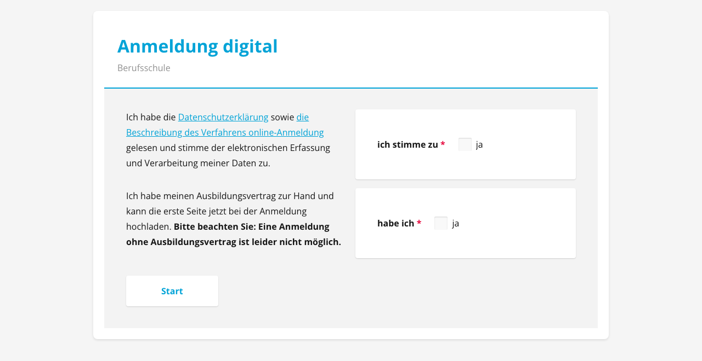
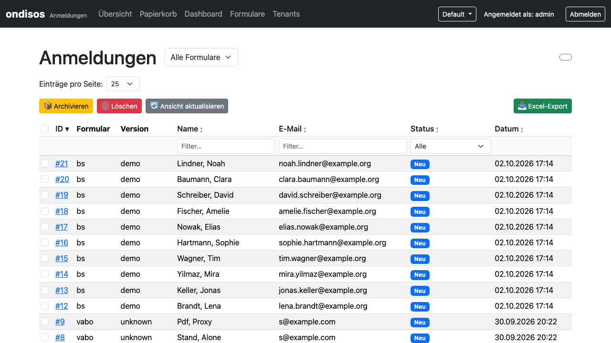
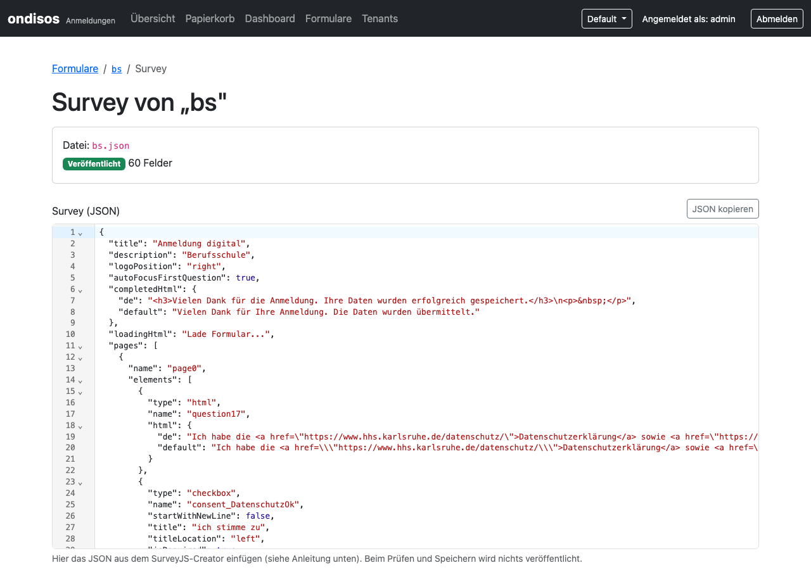
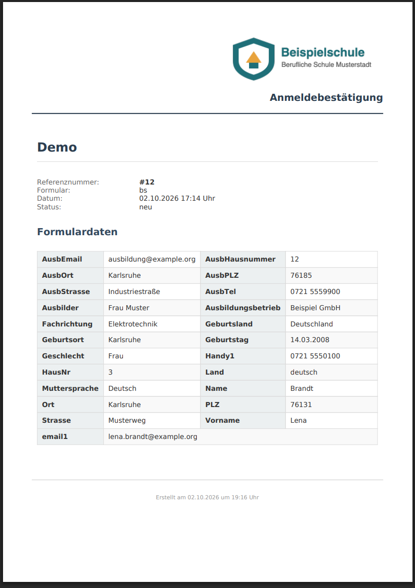
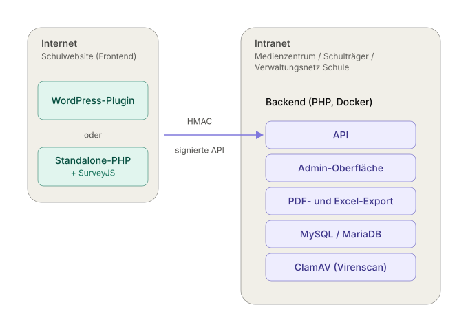

<h1 align="center">Ondisos</h1>

<p align="center">
  <strong>Digital souveräne Schulanmeldung</strong><br>
  <sub><b>On</b>boarding – <b>Di</b>gital <b>S</b>ouverän und <b>O</b>pen <b>S</b>ource</sub>
</p>

<p align="center">
  <a href="https://php.net"></a>
  <a href="LICENSE"></a>
  
  <a href="https://gitlab.hhs.karlsruhe.de/digitale-schulverwaltung/ondisos/-/commits/main"></a>
  <a href="https://gitlab.hhs.karlsruhe.de/digitale-schulverwaltung/ondisos/-/commits/main"></a>
</p>

<p align="center">
  
</p>

Ondisos nimmt Schulanmeldungen online entgegen und bringt sie ohne Abtippen in die Schulverwaltung:
Eltern und Betriebe füllen ein Formular auf der Schulwebsite aus, das Sekretariat findet die Anmeldung
im geschützten Backend, druckt sie aus oder lädt sie als Excel-Datei herunter und importiert sie in
[ASV-BW](docs/sekretariat/ASV.md). Die Daten bleiben auf Servern, die Sie selbst betreiben.

## Was Ondisos kann

- **Formulare ohne Programmierung.** Entwurf im SurveyJS-Creator, Pflege direkt im Backend – mit Prüfung, Vorschau, Verlauf und Wiederherstellen.
- **Eine Installation, mehrere Schulen.** Ein Backend bedient viele Schulen (*Mandanten*), strikt voneinander getrennt – etwa für einen Schulträger oder ein Medienzentrum.
- **Öffentliches Frontend, geschütztes Backend.** Das Formular läuft auf der Schulwebsite (WordPress-Plugin oder eigenständig), die Daten liegen im Intranet. Beide sind per signierter API verbunden.
- **Bestätigung für die Anmeldenden.** PDF mit Schul-Logo und Farbe, optional mit angehängtem Merkblatt.
- **Datenschutz im Blick.** Lokale Schriften, keine externen CDNs, Virenscan der Uploads im eigenen Netz, Audit-Log, automatisches Löschen archivierter Einträge.

<table>
  <tr>
    <td width="50%"><br><sub>Anmeldungen im Backend: filtern, Status setzen, exportieren</sub></td>
    <td width="50%"><br><sub>Formular-Editor: einfügen, prüfen, Vorschau, veröffentlichen</sub></td>
  </tr>
  <tr>
    <td><br><sub>PDF-Bestätigung mit Schul-Logo</sub></td>
    <td><br><sub>Mehrere Schulen pro Backend</sub></td>
  </tr>
</table>

## Wo fange ich an?

| Ich bin … | Ich möchte … | Los geht's |
|---|---|---|
| **Sekretariat** | Anmeldungen ansehen, ausdrucken, als Excel exportieren und in ASV importieren | [Handreichung für Sekretariate](docs/sekretariat/README.md) |
| **Redaktion / Schul-Admin** | Formulare anlegen und ändern, Logo und PDF-Bestätigung pflegen | [Formulare pflegen](docs/README.md#redaktion) |
| **Schul-IT / WordPress-Admin** | das Formular auf der Schulwebsite einbinden | [WordPress-Plugin](wordpress-plugin/INSTALL.md) · [Standalone-Frontend](docs/README.md#schul-it) |
| **Betreiber (Medienzentrum, Schulträger)** | das Backend installieren, Schulen einrichten, betreiben | [Betreiber-Dokumentation](docs/README.md#betreiber) |
| **Entwickler\*in** | Architektur verstehen, Tests ausführen, mitarbeiten | [Entwicklung](docs/README.md#entwicklung) · [CLAUDE.md](CLAUDE.md) |

Das vollständige Verzeichnis aller Dokumente steht in **[docs/README.md](docs/README.md)**.

## Architektur in Kürze

<p align="center">
  
</p>

Das Frontend zeigt die Formulare und nimmt Eingaben entgegen, das Backend speichert, prüft und verwaltet.
Jede Anfrage nennt die Schule (`?tenant=<slug>`) und ist mit deren Secret signiert; das Secret bleibt auf dem Server.
Details: [CLAUDE.md](CLAUDE.md) (Abschnitt Architektur) · [Mehrere Schulen betreiben](docs/betreiber/MULTI-TENANT.md)

## Schnellstart (Backend mit Docker)

Voraussetzungen: Docker mit Compose-Plugin, `openssl`, ein Server im Intranet. Eine Schule, ein Server – so sieht der kürzeste Weg aus:

```bash
git clone https://github.com/digitale-Schulverwaltung-BW/ondisos.git && cd ondisos
cp .env.example .env
sed -i.bak "s/^PDF_TOKEN_SECRET=.*/PDF_TOKEN_SECRET=$(openssl rand -hex 32)/" .env
sed -i.bak "s/^API_SECRET_KEY=.*/API_SECRET_KEY=$(openssl rand -hex 32)/" .env
nano .env    # DB-Passwörter setzen, bevor der erste Start die Datenbank anlegt
docker compose -f docker-compose.yml -f docker-compose.prod.yml up -d
```

Danach fehlen noch der **Admin-Zugang** (Passwort-Hash in der `.env`), die **Formulare** (`seed-forms.php`) und das **Frontend** mit `API_SECRET_KEY` als `TENANT_API_SECRET`.
Diese Schritte, Prüfungen und Stolperfallen (Hash in einfachen Anführungszeichen!) stehen vollständig in der
**[Installationsanleitung](docs/betreiber/DEPLOYMENT.md)**. Ein Upgrade von 2.x oder 3.0 beschreiben [MIGRATION-3.0](docs/betreiber/MIGRATION-3.0.md) und [MIGRATION-3.1](docs/betreiber/MIGRATION-3.1.md).

**Voraussetzungen im Überblick:** Backend: Docker – oder PHP 8.2+, MySQL 8.0+/MariaDB 10.5+, Composer, Erweiterungen `pdo_mysql`, `mbstring`, `gd`.
Frontend: PHP 8.0+ und Apache/Nginx – oder ein WordPress.

## Entwickeln und mitmachen

Beiträge sind willkommen: Fehler melden, Ideen einbringen, Code oder Dokumentation verbessern –
am besten über **[GitHub](https://github.com/digitale-Schulverwaltung-BW/ondisos)** ([Issues](https://github.com/digitale-Schulverwaltung-BW/ondisos/issues), Pull Requests).
Das GitLab der Entwicklung (`gitlab.hhs.karlsruhe.de`) nimmt keine Registrierungen an.

```bash
cp .env.example .env && nano .env
docker compose --profile dev up -d          # Backend + MySQL + Frontend (+ phpMyAdmin)
docker compose exec backend composer test   # oder: make test
```

Konventionen, Tests und Struktur: [CLAUDE.md](CLAUDE.md) · [backend/UNITTESTS.md](backend/UNITTESTS.md).

## Sicherheit

Prepared Statements, Escaping, CSRF-Schutz, Rate Limiting, Mandantentrennung bei jeder Abfrage, signierte API, geprüfte Uploads mit Virenscan,
zeitlich begrenzte PDF-Links und ein Audit-Log.
Einstellungen für den Produktivbetrieb (HTTPS, Secrets, Firewall) und bekannte Einschränkungen: [DEPLOYMENT.md](docs/betreiber/DEPLOYMENT.md) · [CLAUDE.md § Sicherheit](CLAUDE.md#-sicherheit).

## Status und Ausblick

**Version 3.1** – produktiv einsetzbar. Neu: Formulare im Backend pflegen, Schul-Branding für PDFs, WordPress-Plugin als fertige ZIP
([Release Notes](docs/entwicklung/releases/RELEASE-NOTES-3.1.0.md)).

Als Nächstes: WordPress-Plugin ohne Shell (Verbindungscode, Update-Prüfung – [Entwurf](docs/entwicklung/plans/PLAN-3.1.1.md)), SMTP-Versand statt PHP `mail()`, Abschaffung des Datei-Fallbacks für Surveys.
Weitere Ideen: Freigabe-Workflow, Import aus Schulverwaltungssoftware, REST-API.

## Danksagung und Lizenz

Ondisos baut auf [SurveyJS](https://surveyjs.io/), [Bootstrap 5](https://getbootstrap.com/), [DataTables](https://datatables.net/),
[PhpSpreadsheet](https://github.com/PHPOffice/PhpSpreadsheet), [mPDF](https://mpdf.github.io/) und [CodeMirror](https://codemirror.net/).
Der SurveyJS-Creator ist nicht Teil von Ondisos (eigene Lizenz, siehe [SURVEYJS.md](docs/redaktion/SURVEYJS.md)).

Open Source unter der [MIT-Lizenz](LICENSE).
