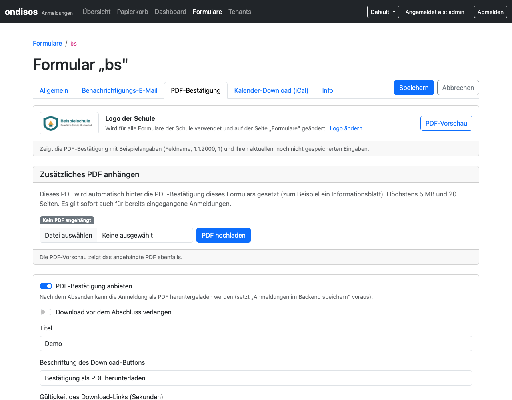

# PDF Download System - Setup & Testing Guide

## Overview

The PDF download system generates on-demand PDF confirmations for form submissions with token-based security.

**Key Features:**
- ✅ HMAC-based secure tokens (self-validating, no database storage)
- ✅ Configurable per form
- ✅ Custom sections (pre/post data table)
- ✅ Logo support with automatic optimization
- ✅ Token expiration (default: 30 minutes)
- ✅ Field filtering and ordering
---

## Setup Instructions

### 1. Install Dependencies

```bash
cd backend
composer install
```

This installs:
- `mpdf/mpdf` (^8.2) - PDF generation library

### 2. Configure Environment

Copy `.env.example` to `.env` and generate a secret key:

```bash
cp .env.example .env

# Generate secure secret (min 32 characters)
openssl rand -hex 32
```

Add to `.env`:
```bash
PDF_TOKEN_SECRET=<your-generated-secret-key>
```

**IMPORTANT:**
- Secret must be at least 32 characters
- Never commit the actual secret to git
- Use different secrets for dev/staging/production

### 3. Configure Forms

The form configuration (including the `pdf` block) is stored in the database (table `form_configs`, one
row per tenant and form; the frontend fetches it from the backend). To create it, copy
`frontend/config/forms-config-dist.php` to `frontend/config/forms-config.php`, edit it and import it:
`php seed-forms.php` (manual install) or, with Docker, `docker compose exec -T backend php seed-forms.php - < frontend/config/forms-config.php`
(tenant 1 only; adds new forms, never overwrites existing rows).
Later changes are made in `form_configs.config_json` (SQL) — see [../MIGRATION-3.0.md § 6](../docs/betreiber/MIGRATION-3.0.md#6-danach-formular-konfiguration-ändern).
The entry looks like this (shown as PHP; it is stored as JSON):

```php
'bs' => [
    'db' => true,
    'form'  => 'bs.json',
    'theme' => 'survey_theme.json',
    'version' => '2026-01-v2',
    'notify_email' => 'sekretariat@example.com',

    // PDF Configuration
    'pdf' => [
        'enabled' => true,
        'required' => false,
        'title' => 'Anmeldebestätigung',
        'download_title' => 'Bestätigung als PDF herunterladen',
        'token_lifetime' => 1800,  // 30 minutes

        // Optional logo path
        'logo' => '/absolute/path/to/logo.png',
        // or relative to backend/templates/pdf/
        'logo' => 'logo.png',

        'header_title' => 'Anmeldebestätigung Berufliches Schulzentrum',
        'intro_text' => 'Vielen Dank für Ihre Anmeldung...',
        'footer_text' => 'Bei Fragen: sekretariat@example.com',

        'include_fields' => 'all',
        'exclude_fields' => ['consent_datenschutz', 'consent_agb'],

        'pre_sections' => [
            [
                'title' => 'Wichtige Hinweise',
                'content' => 'Bitte beachten Sie...'
            ],
        ],

        'post_sections' => [
            [
                'title' => 'Nächste Schritte',
                'content' => 'Nach erfolgreicher Anmeldung...'
            ],
        ],
    ],
],
```

### 4. Optional: Add Logo and accent colour



Recommended: tenant admins upload the school logo (PNG/JPEG, max 2 MB) and pick the accent colour under *Formulare* in the backend; both are stored per school
(`uploads/tenant-<id>/branding/`). The *PDF* tab of the form editor can also attach an extra PDF (max 5 MB / 20 Seiten) behind every confirmation and offers a
preview with sample data. Logo order: `logo: false` → path in the form config → school logo → `PDF_LOGO_<FORM>` → `PDF_LOGO_PATH`.

File-based alternative: place your logo in `backend/templates/pdf/`:

```bash
cp your-logo.png backend/templates/pdf/logo.png
```

The system automatically:
- Resizes to max 150px width
- Converts to JPEG for smaller file size
- Embeds as base64 in PDF

---

## Testing

### Manual Test Flow

#### 1. Test Form Submission

1. Open form in browser:
   ```
   http://your-domain/frontend/index.php?form=bs
   ```

2. Fill out and submit form

3. Check success page for PDF download button
   - Should appear with green background
   - Shows "📄 Bestätigung herunterladen"
   - Displays expiration time (30 minutes)

#### 2. Test PDF Download

1. Click download button

2. Verify PDF opens in browser or downloads

3. Check PDF content:
   - ✓ Header with logo (if configured)
   - ✓ Title and intro text
   - ✓ Meta table (ID, Date, Form)
   - ✓ Pre-sections (if configured)
   - ✓ Data table with all form fields
   - ✓ Post-sections (if configured)
   - ✓ Footer with timestamp

#### 3. Test Token Security

**Valid Token:**
```bash
# Click download link immediately - should work
```

**Expired Token:**
```bash
# Wait 31 minutes, click link again
# Should show: "Ungültiger oder abgelaufener Token"
```

**Invalid Token:**
```bash
# Modify token in URL
http://your-backend/pdf/download.php?token=invalid
# Should show: "Ungültiger oder abgelaufener Token"
```

**Missing Token:**
```bash
http://your-backend/pdf/download.php
# Should show: "Fehlender Download-Token"
```

#### 4. Test Form Without PDF

1. Configure form with `pdf.enabled = false`

2. Submit form

3. Verify NO PDF button appears

#### 5. Test Field Filtering

Configure:
```php
'exclude_fields' => ['consent_datenschutz', 'internal_notes'],
```

Submit form and verify excluded fields don't appear in PDF.

#### 6. Test Custom Sections

Configure pre_sections and post_sections, verify they appear in correct position.

---

## Debugging

### Enable Debug Logging

In PdfGeneratorService.php, add after PDF generation:

```php
error_log('PDF generated successfully for Anmeldung #' . $anmeldung->id);
error_log('PDF size: ' . strlen($pdfContent) . ' bytes');
```

### Common Issues

**1. "Class 'Mpdf\Mpdf' not found"**
```bash
cd backend
composer install
```

**2. "Secret key must be at least 32 characters"**

Generate new secret:
```bash
openssl rand -hex 32
```

Add to `.env`:
```bash
PDF_TOKEN_SECRET=abc123...
```

**3. "Ungültiger oder abgelaufener Token" immediately**

Check:
- PDF_TOKEN_SECRET is set in .env
- Same secret in dev/staging/production
- System time is correct

**4. Logo not appearing**

Check:
- File path is correct (absolute or relative to `backend/templates/pdf/`)
- File is readable (chmod 644)
- File format is supported (PNG, JPG, GIF)

**5. PDF generation fails silently**

Check PHP error logs:
```bash
tail -f /var/log/apache2/error.log
# or
tail -f /var/log/php-fpm/error.log
```

Enable mPDF debug mode in PdfGeneratorService.php:
```php
$mpdf = new Mpdf([
    'mode' => 'utf-8',
    'debug' => true,
    'showImageErrors' => true,
]);
```

**6. Fonts not rendering correctly**

mPDF uses DejaVu Sans by default (supports German umlauts).

If issues persist, check:
```bash
ls -la vendor/mpdf/mpdf/ttfonts/
```

**7. Memory issues with large PDFs**

Increase PHP memory limit in `.htaccess` or `php.ini`:
```ini
memory_limit = 256M
```

---

## Security Notes

### Token Security

- Tokens are HMAC-signed (SHA256)
- Self-validating (no database lookup needed)
- Expire after configured lifetime (default: 30 min)
- Cannot be forged without secret key

### Token Format

```
base64(id:timestamp:lifetime:hmac)
```

Example:
```
MTIzOjE3MDYwMDAwMDA6MTgwMDphYmMxMjM...
```

Decoded:
```
123:1706000000:1800:abc123def456...
         ↑        ↑       ↑
      timestamp  lifetime  HMAC
```

### Best Practices

1. **Secret Key Management:**
   - Use different secrets per environment
   - Rotate secrets periodically
   - Never commit to git
   - Store in `.env` only

2. **Token Lifetime:**
   - Default 30 minutes is secure
   - Shorter for sensitive data
   - Longer for convenience (max 24h)

3. **HTTPS:**
   - Always use HTTPS in production
   - Prevents token interception

4. **Rate Limiting:**
   - Consider adding rate limiting to download.php
   - Prevents token brute-force

---

## Performance

### PDF Generation Speed

Typical generation time:
- Simple form (10 fields): ~100-200ms
- Complex form (50 fields): ~300-500ms
- With logo: +50-100ms

### Optimization Tips

1. **Logo Optimization:**
   - Use small logos (<100KB)
   - System auto-resizes to 150px
   - Auto-converts to JPEG

2. **Field Filtering:**
   - Exclude unnecessary fields
   - Reduces PDF size and generation time

3. **Caching:**
   - PDFs are generated on-demand (no storage)
   - Browser may cache downloaded PDFs

4. **Server Resources:**
   - mPDF uses ~30-50MB memory per PDF
   - Ensure adequate PHP memory_limit

---

## File Structure

```
backend/
├── src/
│   ├── Services/
│   │   ├── PdfGeneratorService.php
│   │   ├── PdfTemplateRenderer.php
│   │   └── PdfTokenService.php
│   ├── Utils/
│   │   └── DataFormatter.php
│   └── Config/
│       └── FormConfig.php
├── templates/
│   └── pdf/
│       ├── base.php
│       ├── styles.css
│       └── sections/
│           ├── header.php
│           ├── data-table.php
│           ├── custom-section.php
│           └── footer.php
├── public/
│   ├── api/
│   │   └── submit.php (adds pdf_download to response)
│   └── pdf/
│       └── download.php (token validation & PDF delivery)
├── composer.json
└── .env (PDF_TOKEN_SECRET)

frontend/
├── config/
│   └── forms-config-dist.php (template; the active config lives in the DB table form_configs)
├── src/
│   ├── Services/
│   │   └── AnmeldungService.php (passes pdf_download)
│   └── Config/
│       └── FormConfig.php
└── public/
    └── js/
        └── survey-handler.js (displays PDF button)
```

---

## API Response Format

### Success Response with PDF

```json
{
  "success": true,
  "id": 123,
  "pdf_download": {
    "enabled": true,
    "required": false,
    "url": "/backend/public/pdf/download.php?token=abc123...",
    "title": "Bestätigung herunterladen",
    "expires_in": 1800
  },
  "warnings": []
}
```

### Success Response without PDF

```json
{
  "success": true,
  "id": 123,
  "warnings": []
}
```

---

## Note: PDF settings are captured per submission

The PDF configuration is stored with each registration (`anmeldungen.pdf_config`, sent by the frontend at
submission time). `pdf/download.php` renders the PDF from that stored copy. Changing `pdf` settings in
`form_configs` therefore affects **new** registrations only; existing ones keep the settings they were submitted with.
The backend-side logo fallback (`PDF_LOGO_<FORM>` / `PDF_LOGO_PATH`) is applied at download time.

## Troubleshooting Checklist

Before asking for help, check:

- [ ] Composer install completed successfully
- [ ] PDF_TOKEN_SECRET is set in .env (min 32 chars)
- [ ] Form has `pdf.enabled = true` in `form_configs.config_json` (and the submission was made after enabling it — see below)
- [ ] PHP version >= 8.1
- [ ] Memory limit >= 128M (256M recommended)
- [ ] File permissions are correct (uploads, cache, logs)
- [ ] Error logs checked (Apache, PHP-FPM)
- [ ] Token has not expired (check timestamp)
- [ ] Logo path is correct (if using logo)

---

## Support

For issues or questions:

1. Check error logs first
2. Review this guide
3. Check CLAUDE.md for architecture details
4. Create issue with:
   - Error message
   - Steps to reproduce
   - PHP version
   - Composer output

---

**Last Updated:** January 2026
**Version:** 1.0
