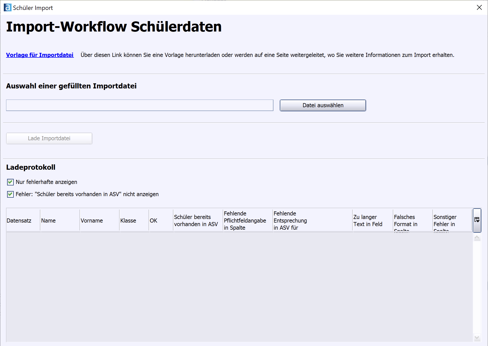
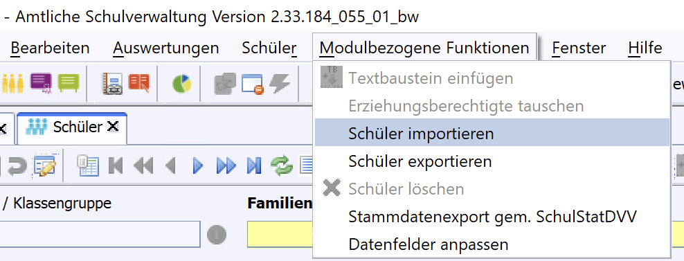

# 🗂️ Anbindung an ASV-BW
## Voraussetzungen
Wenn das Survey-Element die erforderlichen Feld-Bezeichner hat, lässt sich ein Excel-Export aus dem Backend direkt in das Schüler-Modul von ASV-BW (und Bayern?) importieren.

Die Feldnamen lassen sich der Vorlage entnehmen: [Link zur Excel-Vorlage](https://asv.kultus-bw.de/site/pbs-bw-km-root/get/documents_E-1173628749/KULTUS.Dachmandant/KULTUS/Projekte/asv-bw/Rollout/Import/ASV-BW_Import.xlsx), Stand Februar 2026. Die Vorlage ist auch über die Import-Funktion von ASV abrufbar:

Die mitgelieferte Anmeldung "bs.json" enthält eine Vielzahl der Felder, die ASV importieren kann. Leider wird aktuell nicht der ganze Datenumfang der Excel-Datei importiert, dieses Feature fehlt in ASV-BW noch.

Der Schüler-Import von ASV wird über das Schüler-Modul, Menüpunkt "Modulbezogene Funktionen" aufgerufen.

Die Excel-Filterelemente, die ondisos beim Backend-Excel-Export erzeugt, behindern den Excel-Import nicht.