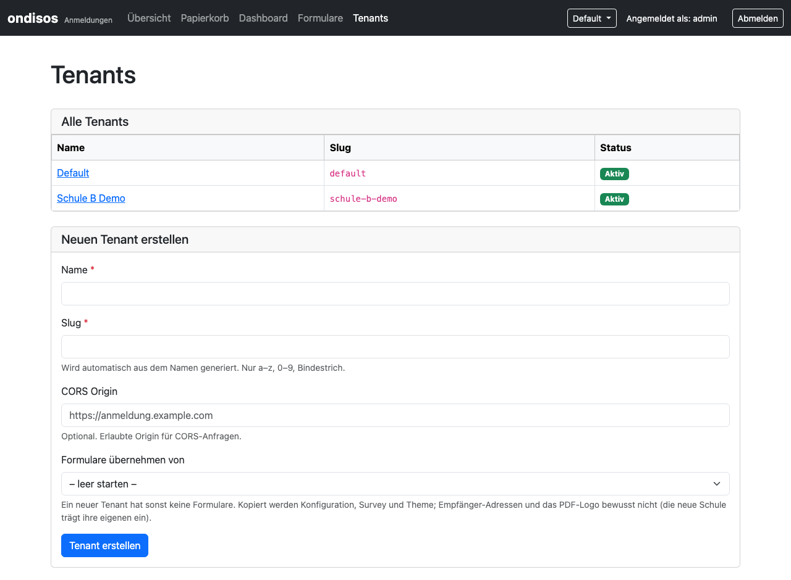

# Multi-Tenant-Betrieb (ab 3.0)

Ab Version 3.0 kann eine Backend-Instanz mehrere Schulen bedienen — mit vollständiger
Datenisolierung pro Schule (*Tenant*). Dieses Dokument ist die Betriebsanleitung.

- **Upgrade von 2.x:** → [MIGRATION-3.0.md](MIGRATION-3.0.md)
- **Architektur-Hintergründe** (Design-Entscheidungen, Datenbankschema, Impact Assessment):
  → [`backend/MULTI-TENANT.md`](../backend/MULTI-TENANT.md)
- **Betrieb/Deployment allgemein:** → [DEPLOYMENT.md](DEPLOYMENT.md)

---

## Inhalt

1. [Betriebsmodi](#betriebsmodi)
2. [Multi-Tenant aktivieren](#multi-tenant-aktivieren)
3. [Tenant anlegen](#tenant-anlegen-platform-admin)
4. [Frontend für einen Tenant konfigurieren](#frontend-für-einen-tenant-konfigurieren)
5. [Formular-Konfiguration pro Tenant](#formular-konfiguration-pro-tenant)
6. [Szenario: Mehrere Frontends → ein Backend](#szenario-mehrere-frontends--ein-backend)
7. [Tenant-Switcher](#tenant-switcher-platform-admin)
8. [Sicherheit](#sicherheit)
9. [Roadmap](#roadmap)

---

## Betriebsmodi

| Modus | Konfiguration | Beschreibung |
|-------|--------------|--------------|
| **Single-Tenant** (Standard) | `MULTI_TENANT_ENABLED=false` (oder nicht gesetzt) | Eine Schule. Kein Login-Zwang (außer `AUTH_ENABLED=true`), keine Tenant-Oberfläche. Alle Anmeldungen gehören zu Tenant 1 ("Default"). |
| **Multi-Tenant** | `MULTI_TENANT_ENABLED=true` | Mehrere Schulen. Login ist **erzwungen**; Platform-Admin verwaltet Tenants, Tenant-Admins sehen nur die Daten ihrer Schule. |

Das Schema ist in beiden Modi identisch: Die Tabellen `tenants`, `tenant_admins` und
`form_configs` sowie die Spalte `anmeldungen.tenant_id` gibt es immer, Tenant 1 wird bei der
Migration automatisch angelegt. Ein Wechsel von Single- auf Multi-Tenant ist daher jederzeit
durch Setzen des Flags möglich.

Auch im Single-Tenant-Betrieb gilt: Das Frontend signiert seine Anfragen mit dem API-Secret
des Tenants (`TENANT_API_SECRET`), und die Formular-Konfiguration liegt in der Datenbank.
Wer von 2.x kommt, findet die nötigen Schritte in [MIGRATION-3.0.md](MIGRATION-3.0.md).

---

## Multi-Tenant aktivieren

### 1. Voraussetzungen

- Die Migration ist gelaufen (Docker: automatisch bei jedem Containerstart; manuell:
  `php backend/migrate.php`).
- `API_SECRET_KEY` ist ein echtes Secret — bekannte Standardwerte werden in Production
  abgelehnt (siehe [Sicherheit](#sicherheit)).

### 2. Platform-Admin-Credentials erzeugen

```bash
# Passwort-Hash erzeugen (Docker)
docker compose exec backend php -r "echo password_hash('dein-sicheres-passwort', PASSWORD_DEFAULT) . PHP_EOL;"

# Oder direkt mit PHP
php -r "echo password_hash('dein-sicheres-passwort', PASSWORD_DEFAULT) . PHP_EOL;"
```

### 3. `.env` anpassen

```bash
# Root .env (oder backend/.env)
MULTI_TENANT_ENABLED=true

# Platform Admin (erforderlich, wenn Multi-Tenant aktiv ist)
ADMIN_USERNAME=admin
ADMIN_PASSWORD_HASH='$2y$10$...'   # Hash aus Schritt 2
```

> **Wichtig:** Den Hash in **einfache Anführungszeichen** setzen. Docker Compose interpretiert
> `$…` in der Root-`.env` sonst als Variablen und verstümmelt den Hash (alternativ jedes `$`
> als `$$` schreiben).

### 4. Backend neu starten

```bash
docker compose up -d backend    # Container neu erstellen, damit die geänderte Root-.env ankommt
# (ein bloßes `restart` übernimmt geänderte Compose-Variablen nicht);
# ohne Docker: Apache/PHP-FPM neu laden
```

### 5. Als Platform-Admin einloggen

`http://backend.example.com/login.php` mit dem konfigurierten Benutzernamen und Passwort.
Der Platform-Admin sieht alle Tenants und kann zwischen ihnen wechseln.

---

## Tenant anlegen (Platform-Admin)

### Über die Backend-Oberfläche



1. `http://backend.example.com/tenants.php` öffnen.
2. **„Neuen Tenant erstellen"**:
   - **Name**, z. B. `Berufliches Schulzentrum Karlsruhe`
   - **Slug**, z. B. `bsz-karlsruhe` (Kleinbuchstaben, Ziffern, Bindestriche; wird aus dem Namen vorgeschlagen)
   - **CORS Origin:** URL des zugehörigen Frontends, z. B. `https://anmeldung.bsz-karlsruhe.de` (optional)
   - **Formulare übernehmen von:** ein neuer Tenant hat **keine Formulare** („Formular nicht gefunden", sobald das Frontend läuft).
     Hier lassen sich die Formulare eines bestehenden Tenants übernehmen (3.1); „leer starten" legt keine an.
3. Nach dem Speichern erscheint der **API-Schlüssel** (das Tenant-Secret) —
   **jetzt sichern, er wird nur einmal angezeigt.** Er geht als `TENANT_API_SECRET` in die
   Frontend-Konfiguration. Verloren? Auf der Tenant-Seite *„Secret neu generieren"* — das alte
   Secret ist danach ungültig, das Frontend muss angepasst werden.

### Neuen Tenant einrichten (Checkliste)

1. Tenant anlegen (siehe oben), **Formulare übernehmen** (oder später auf der Tenant-Seite bzw. unter *Formulare*, *Formulare von einem
   anderen Tenant übernehmen*; auf der Kommandozeile `php copy-forms.php --from=<quelle> --to=<neu>`).
2. **Empfänger eintragen:** Beim Kopieren werden `notify_email` und das PDF-Logo **bewusst nicht** übernommen (sonst gingen die
   Anmeldungen der neuen Schule per Mail an das Sekretariat der alten). Unter *Formulare → Bearbeiten* trägt die Schule ihre Adresse ein.
   Ein kopiertes Formular ohne Speichern im Backend (`db: false`) und ohne Empfänger wird vom Frontend **nicht angezeigt**, bis
   ein Empfänger eingetragen ist — es gehen keine Anmeldungen verloren.
3. Texte prüfen: Titel, PDF-Texte, Kalendereintrag und Mail-Einleitung werden kopiert und im Bericht aufgelistet (nennen sie noch die alte Schule?).
   Enthält die Survey E-Mail-Adressen oder Telefonnummern, steht das ebenfalls im Bericht.
4. Tenant-Admin anlegen, Secret und Slug ins Frontend bzw. WordPress-Plugin eintragen. Der Verbindungsstatus des Plugins zeigt dann
   „Tenant-API-Secret: passt zum Tenant" und die Zahl der Formulare (bei 0: Hinweis).

Nur **Plattform-Admins** dürfen kopieren (es werden Formulare eines anderen Tenants gelesen). Kopiert werden Konfiguration, Survey und Theme;
**nie** Anmeldungen, Uploads, Entwürfe, Verlauf oder das API-Secret. Vorhandene Formulare des Ziels bleiben unverändert (außer mit
„Vorhandene Formulare ersetzen" / `--overwrite`; der alte Stand bleibt dann im Verlauf). Das Kopieren geschieht ganz oder gar nicht.

### Tenant-Admin anlegen

Auf der Tenant-Detailseite (`tenants.php?id=<id>`) unter **„Admin hinzufügen"**:
Benutzername und Passwort setzen und das Passwort beim ersten Anzeigen sichern. Der Tenant-Admin
loggt sich über `login.php` ein und sieht ausschließlich die Daten seines Tenants.

---

## Frontend für einen Tenant konfigurieren

Jedes Frontend gehört zu genau einem Tenant und braucht dessen **Slug** und **Secret**.

### Standalone-Frontend

```bash
# frontend/.env
BACKEND_API_URL=http://backend.example.com/api
TENANT_SLUG=bsz-karlsruhe               # Slug des Tenants
TENANT_API_SECRET=abc123...             # API-Schlüssel des Tenants (aus tenants.php)
```

Formulare werden wie gewohnt aufgerufen:

```
http://anmeldung.bsz-karlsruhe.de/index.php?form=bs
```

Das Frontend hängt den Slug an jeden API-Aufruf an (`?tenant=bsz-karlsruhe`) und signiert
Submit und Upload mit dem Secret (`X-Signature`). Das Secret verlässt den Server nie.
Ohne `TENANT_SLUG` gilt `default` (Tenant 1).

### WordPress-Plugin

Der Tenant gehört zur **Installation**, nicht zur einzelnen Seite — der Shortcode bleibt:

```
[ondisos form="bs"]
```

Slug und Secret stehen unter *Einstellungen → Ondisos* (Felder **Tenant-Slug** und
**Tenant-API-Secret**; das Secret wird nie wieder angezeigt, leer lassen = unverändert) oder
alternativ in `plugins/ondisos-frontend/.env`. Die WordPress-Einstellungen haben Vorrang.
Siehe [wordpress-plugin/INSTALL.md](../wordpress-plugin/INSTALL.md).

---

## Formular-Konfiguration pro Tenant

Jeder Tenant hat seine eigene Formular-Konfiguration in `form_configs` (Schlüssel: Tenant +
Formular-Key). Das Frontend holt sie bei jedem Aufruf über `/api/form-config.php?form=…&tenant=…`.

- `seed-forms.php [--tenant=<slug>]` übernimmt eine vorhandene `forms-config.php` (überschreibt nichts, prüft jeden Eintrag).
- Ab 3.1 pflegen Schul-Admins ihre Formulare im Backend (*Formulare*); neue Tenants starten mit den Formularen eines anderen Tenants
  (`copy-forms.php` bzw. Tenant-Seite, siehe „Neuen Tenant einrichten").
- Per SQL geht es weiterhin:

```sql
INSERT INTO form_configs (tenant_id, form_key, config_json)
VALUES (5, 'bs', '{"db": true, "form": "bs.json", "theme": "survey_theme.json", "notify_email": "sekretariat@schule.example"}');

-- Ändern
UPDATE form_configs SET config_json = '{...}' WHERE tenant_id = 5 AND form_key = 'bs';
```

Die Survey-Definitionen (`frontend/surveys/*.json`) liegen im Dateisystem des jeweiligen
Frontends; `config_json.form` verweist darauf.

---

## Szenario: Mehrere Frontends → ein Backend

```
Frontend BSZ Karlsruhe          Frontend Gymnasium Ettlingen
(anmeldung.bsz-karlsruhe.de)    (anmeldung.gym-ettlingen.de)
         |                               |
         | tenant=bsz-karlsruhe          | tenant=gym-ettlingen
         | X-Signature (Secret BSZ)      | X-Signature (Secret Gym)
         └───────────────┬───────────────┘
                         ▼
               Backend (Intranet)
               backend.gemeinde.de
               ├── Tenant: bsz-karlsruhe
               └── Tenant: gym-ettlingen
```

Jedes Frontend hat eine eigene `.env` mit dem zugehörigen Slug und Secret.

---

## Tenant-Switcher (Platform-Admin)

Der Platform-Admin wechselt im Backend über das Menü in der Kopfzeile (oder per URL) zwischen
Tenants:

- **Alle Tenants** anzeigen: `?switch_tenant=0`
- **Bestimmten Tenant** anzeigen: `?switch_tenant=<id>`

Der aktive Kontext wird in der Session gespeichert und in der Navigation angezeigt.

---

## Sicherheit

- **Datenisolierung:** Alle Datenbank-Abfragen filtern nach `tenant_id`. Der Zugriff auf einen
  Eintrag eines anderen Tenants wird als IDOR-Versuch im Audit-Log protokolliert
  (`idor_attempt`) und liefert „nicht gefunden".
- **API-Authentifizierung:** Jeder Tenant hat ein eigenes Secret (`tenants.api_secret`).
  `submit.php` und `upload.php` verlangen `?tenant=<slug>` und `X-Signature`
  (HMAC-SHA256). Der Slug *adressiert* nur den Tenant — *autorisiert* wird ausschließlich über
  die Signatur. Protokoll: [MIGRATION-3.0.md § Eigene API-Clients](MIGRATION-3.0.md#7-eigene-api-clients).
- **Keine bekannten Secrets:** Platzhalter (`CHANGE_ME_IN_PRODUCTION`, leer) authentifizieren
  nie; der mitgelieferte Dev-Standardwert (`dev-api-key-replace-in-production`) wird in
  Production (`APP_ENV=production`) abgelehnt. `migrate.php` bricht dort ab, wenn
  `API_SECRET_KEY` so ein Wert ist. Siehe [SecretPolicy](../backend/src/Services/SecretPolicy.php).
- **Upload-Isolierung:** Dateien liegen in `uploads/tenant-<id>/`. Ein Upload wird nur
  angenommen, wenn der Zieleintrag zum authentifizierten Tenant gehört (sonst `404` +
  `idor_attempt`).
- **PDF-Download:** Der HMAC-Token (`PDF_TOKEN_SECRET`) autorisiert genau eine Anmeldung.
  Der Endpoint ermittelt deren Tenant, setzt den Kontext und lädt den Eintrag dann über die
  normale, tenant-gefilterte Abfrage.
- **Audit-Log:** Jeder Eintrag in `backend/logs/audit.log` enthält `tenant_id`.
- **TenantContext:** Wird einmal pro Request initialisiert; ein nicht initialisierter Kontext
  wirft eine Exception (kein stilles Durchfallen auf „alle Daten").
- **Öffentliche Formular-Konfiguration:** `/api/form-config.php` liefert die Konfiguration an
  jeden, der den Tenant-Slug kennt (ohne Signatur) — sie enthält z. B. `notify_email`.
  Keine Geheimnisse in `config_json` ablegen.
- **Login erzwungen:** Mit `MULTI_TENANT_ENABLED=true` ist die Backend-Anmeldung immer aktiv,
  unabhängig von `AUTH_ENABLED`.

---

## Roadmap

| Feature | Version | Status |
|---------|---------|--------|
| Mehrere Frontends → ein Backend | 3.0 | ✅ implementiert |
| Form-Config-Admin-UI (HTML-Formular im Backend) | 3.1 | ✅ implementiert |
| Surveys im Backend pflegen (Einfügen, Vorschau, Verlauf), Frontend zieht sie per API | 3.1 | ✅ implementiert |
| Neue Tenants: Formulare von einem anderen Tenant übernehmen | 3.1 | ✅ implementiert |
| WordPress-Plugin als ZIP (ohne Shell installierbar) | 3.1 | ✅ implementiert |
| Schul-Branding der PDFs (Logo-Upload, Akzentfarbe, Anhang pro Formular) | 3.1 | ✅ implementiert |
| Verbindungscode und Update-Prüfung für das Plugin | 3.1.x | geplant ([PLAN-3.1.1.md](plans/PLAN-3.1.1.md)) |
| Datei-Fallback für Surveys abschaffen | offen | ohne Termin |
| Managed Multi-Frontend (ein Frontend, mehrere Tenants) | – | gestrichen, bleibt als Option |
