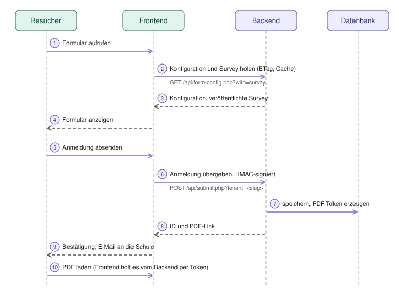

# Architektur und Datenfluss

Aufbau des Systems, Datenfluss, Datenbankschema, Funktionsumfang und Status-Ablauf. Einstieg und Konventionen: [CLAUDE.md](../../CLAUDE.md).

## Architektur

### Gesamtstruktur

```
projekt/
├── frontend/                      # Öffentlich zugänglich
│   ├── public/
│   │   ├── index.php             # Formular-Anzeige (holt die Config vom Backend)
│   │   ├── save.php              # API-Endpoint für Submissions
│   │   ├── ical.php              # iCal-Download (optional pro Formular)
│   │   ├── csrf_token.php
│   │   ├── pdf/download.php      # PDF Download Proxy (leitet zum Backend)
│   │   ├── api/messages.json.php # UI-Texte für JavaScript
│   │   └── js/
│   │       ├── survey-handler-base.js  # gemeinsame Basis (Standalone + WordPress)
│   │       └── survey-handler.js       # Standalone-Handler
│   ├── inc/bootstrap.php         # Autoloader, .env laden
│   ├── src/
│   │   ├── Config/
│   │   │   ├── FormConfig.php        # Config-Container (wird per load() befüllt)
│   │   │   ├── FormConfigLoader.php  # holt/merged die Config (+ Survey/Theme) eines Formulars
│   │   │   ├── FormBundleCache.php   # Datei-Cache (ETag, Stale-if-error), frontend/cache/forms
│   │   │   └── SurveySource.php      # Survey/Theme: Backend zuerst, sonst frontend/surveys/*.json
│   │   ├── Services/
│   │   │   ├── AnmeldungService.php
│   │   │   ├── BackendApiClient.php  # signiert Requests, hängt ?tenant= an
│   │   │   ├── EmailService.php
│   │   │   └── MessageService.php
│   │   └── Utils/CsrfProtection.php · ClientIp.php
│   ├── config/
│   │   ├── forms-config-dist.php     # Vorlage / Quelle für backend/seed-forms.php
│   │   └── messages.php
│   └── surveys/                  # SurveyJS-Definitionen (bs.json, vabo.json, ...)
│
├── wordpress-plugin/              # Alternative zum Standalone-Frontend
│   ├── ondisos.php               # Plugin-Bootstrap, Shortcode [ondisos form="…"]
│   ├── includes/                 # class-shortcode, -ajax-handler, -pdf-proxy, -settings,
│   │                             # -form-config-loader, -assets, -plugin, -autoloader
│   ├── assets/js/survey-handler-wp.js
│   └── INSTALL.md · INSTALL-AUS-GIT.md
│
├── docs/                          # Betriebs- und Projektdokumentation (Index: docs/README.md)
│   ├── betreiber/ · redaktion/ · sekretariat/ · schul-it/   # nach Rolle
│   └── entwicklung/              # plans/ (PLAN-3.1.md, …), releases/, CI_CD.md, TODO.md
│
├── database/
│   ├── schema.sql                # Neuinstallation (Tenant 1 mit Platzhalter-Secret!)
│   └── migrations/               # einzelne SQL-Migrationen (z. B. add_pdf_config_column.sql, add_form_editor_tables.sql)
│
└── backend/                       # Intranet-Admin
    ├── migrate.php               # Schema-Migration auf 3.0 (idempotent)
    ├── seed-forms.php            # forms-config.php → Tabelle form_configs; `[--tenant=<slug>] [<datei>|-]` (Pfad bzw. STDIN), validiert jeden Eintrag
    ├── copy-forms.php            # Formulare von Tenant zu Tenant kopieren (3.1): `--from --to [--forms] [--overwrite] [--dry-run]`
    ├── import-surveys.php        # Survey-/Theme-Dateien → Datenbank (3.1): `[--tenant=<slug>] [--overwrite] [--dry-run] <verzeichnis>`
    ├── public/
    │   ├── index.php · detail.php · trash.php · dashboard.php
    │   ├── forms.php · form_edit.php   # Formular-Editor (3.1): Liste, anlegen, Konfiguration als HTML-Formular, Verlauf, löschen
    │   ├── form_pdf_preview.php · tenant_logo.php   # PDF-Vorschau mit Beispielangaben (GET gespeichert / POST aktuelle Formularwerte); Logo-Thumbnail
    │   ├── form_preview.php · form_preview_frame.php   # Vorschau (3.1): Entwurf/veröffentlichte Survey wie für Besucher, in einem per CSP sandboxed Frame
    │   ├── form_survey.php             # Survey-Editor (3.1): JSON einfügen/laden, prüfen (mit Zeilen), Diff, Entwurf, veröffentlichen, wiederherstellen
    │   ├── assets/                     # preview/ (SurveyJS-Laufzeit, Kopie des Frontends; tools/sync-preview-assets.sh), survey-editor.js; codemirror/survey-editor-cm.js (CodeMirror 6, MIT, vorgebaut; Quellen: tools/survey-editor-bundle/)
    │   ├── excel_export.php · bulk_actions.php · change_status.php
    │   ├── restore.php · hard_delete.php · download.php (Datei-Download)
    │   ├── login.php · logout.php
    │   ├── tenants.php           # Tenant-Verwaltung (Platform-Admin)
    │   ├── pdf/
    │   │   ├── download.php          # PDF per Token (ohne Session)
    │   │   └── admin_download.php    # PDF aus der Detailansicht (Admin)
    │   └── api/
    │       ├── submit.php        # Anmeldung speichern (HMAC)
    │       ├── upload.php        # Datei-Upload (HMAC, Virenscan)
    │       ├── form-config.php   # Formular-Konfiguration je Tenant (öffentlich per Slug); ?with=survey liefert Survey/Theme + ETag
    │       ├── forms.php         # Formular-Schlüssel des eigenen Tenants (HMAC über "forms:<slug>", für den Plugin-Status)
    │       └── health.php
    ├── src/
    │   ├── Config/        Config · Database · EnvLoader · FormConfig · TenantContext
    │   ├── Models/        Anmeldung · AnmeldungStatus (Enum)
    │   ├── Repositories/  AnmeldungRepository · TenantRepository · TenantAdminRepository
    │   │                  FormConfigRepository · FormResourceRepository · FormDraftRepository · FormRevisionRepository  (3.1, alle tenant-gefiltert)
    │   ├── Forms/         (3.1, reine Logik ohne DB) ValidationResult · Identifiers · SurveyValidator · HtmlPolicy · ThemeValidator
    │   │                  SurveyFieldExtractor · SurveyLinter · FormConfigSchema · FormConfigValidator · FormConfigFormMapper · EditorAccess · JsonLocator · SurveyDiff · ServiceResult
    │   ├── Controllers/   AnmeldungController · DetailController · BulkActionsController · DownloadController · FormEditorController · SurveyEditorController · SurveyPreviewController
    │   ├── Services/      AnmeldungService · StatusService · ExportService · SpreadsheetBuilder
    │   │                  ExpungeService · RequestExpungeService
    │   │                  PdfGeneratorService · PdfTemplateRenderer · PdfTokenService
    │   │                  HmacValidator · SecretPolicy · RateLimiter · VirusScanService · AuditLogger · UploadCleanupService
    │   │                  LoginService · MessageService · NominatimService · SchoolLookupService
    │   │                  FormPublishService · FormDeliveryService · SurveyImportService · FormSeedService · FormCopyService  (3.1)
    │   │                  TenantLogoService · PdfLogoResolver  (Schul-Logo: Upload durch Tenant-Admins, Reihenfolge der Logo-Quellen)
    │   ├── Cli/           CliArgs · ImportSurveysCommand · CopyFormsCommand  (Logik der CLI-Skripte, testbar)
    │   ├── Validators/    AnmeldungValidator
    │   └── Utils/         ClientIp · DataFormatter · FilenameSanitizer · NullableHelpers
    ├── inc/               bootstrap · auth · csrf · header · footer · form_editor · form_fields · form_copy (Editor-Helfer)
    ├── templates/pdf/     base.php · styles.css · sections/
    ├── config/            messages.php (+ messages.local.php, forms-config.php als Seed-Fallback)
    ├── scripts/           generate-password-hash.php
    ├── uploads/           tenant-<id>/ je Tenant · cache/ · logs/ (audit.log)
    ├── tests/             Unit/ · Integration/
    └── composer.json · PDF_SETUP.md · UPLOAD_SECURITY.md · UNITTESTS.md · MULTI-TENANT.md
```

### Tenant-Kontext

`TenantContext` (statisch, einmal pro Request) bestimmt den aktiven Tenant; `bootstrap.php` initialisiert ihn:

| Situation | Tenant |
|---|---|
| `MULTI_TENANT_ENABLED=false` | immer Tenant 1 |
| API-Request (`API_REQUEST`) | aus `?tenant=<slug>`; unbekannt/inaktiv ⇒ uninitialisiert ⇒ `401` |
| Browser, Tenant-Admin | aus der Session (`tenant_id`) |
| Browser, Platform-Admin | `switch_tenant`: ein Tenant oder „alle" (`isAllTenants()`) |
| Token-Endpoint (`pdf/download.php`) | Tenant der per Token autorisierten Anmeldung (`findTenantIdById()`) |

Ein nicht initialisierter Kontext wirft eine Exception (kein stilles Durchfallen auf „alle Daten"). Repositories filtern **jede** Abfrage nach `tenant_id` (außer im All-Tenants-Modus); `AnmeldungRepository::findById()` protokolliert fremde IDs als `idor_attempt`.

---

## Datenfluss




### Formular anzeigen

```
1. Browser ruft frontend/public/index.php?form=bs auf (oder eine WordPress-Seite mit [ondisos form="bs"])
   ↓
2. FormConfigLoader::ensureWithSurvey('bs') → BackendApiClient::fetchFormBundle()
   GET {BACKEND_API_URL}/form-config.php?form=bs&tenant={TENANT_SLUG}&with=survey
   Header If-None-Match: <ETag der zwischengespeicherten Fassung>
   ↓
3. Backend: Config + veröffentlichte Survey/Theme (nie Entwürfe) + ETag; unverändert ⇒ 304.
   Antwort {"success":true,"config":{…},"survey_json":"…"|null,"theme_json":"…"|null}
   Das Frontend legt sie in FormBundleCache ab (frontend/cache/forms, WordPress: uploads/ondisos-cache)
   (Formular unbekannt ⇒ 404; Backend nicht erreichbar / Tenant abgelehnt ⇒ Wartungsseite 503 bzw. im Plugin eine neutrale Meldung für Besucher und die Diagnose für Administratoren; Ursache im PHP-Log)
   ↓
4. Backend nicht erreichbar ⇒ die zwischengespeicherte Fassung (höchstens 7 Tage alt) wird ausgeliefert;
   ohne Cache ⇒ Wartungsseite 503, bei unbekanntem Formular 404, bei abgelehntem Tenant 503 (Plugin: Fehlermeldung)
   ↓
5. SurveySource: Survey/Theme aus dem Backend, sonst Datei frontend/surveys/<form>.json (Fallback wie in 3.0);
   JsonEmbed kodiert beides neu (\u003C …), damit „</script>" im JSON nie aus dem <script>-Element ausbricht
```

### Submission Flow (Neue Anmeldung)

```
1. User füllt Formular aus
   ↓
2. JavaScript (survey-handler-base.js + survey-handler.js / -wp.js) sammelt Daten
   ↓
3. POST an frontend/public/save.php  (WordPress: admin-ajax.php?action=ondisos_submit)
   CSRF-Prüfung (Standalone) bzw. WP-Nonce
   ↓
4. Frontend AnmeldungService validiert & verarbeitet
   ↓
5. BackendApiClient signiert den Raw-Body mit dem Tenant-Secret und sendet ihn an
   POST {BACKEND_API_URL}/submit.php?tenant={slug}   Header: X-Signature: HMAC-SHA256
   ↓
6. Backend: Tenant auflösen → HMAC prüfen (HmacValidator + SecretPolicy) → Rate Limit →
   Validierung → AnmeldungRepository speichert mit tenant_id → PDF-Token erzeugen
   ↓
7. Uploads: pro Datei POST upload.php?tenant={slug}  (X-Signature über "id:feld:dateiname");
   Backend prüft, dass die Anmeldung zum Tenant gehört, scannt mit ClamAV, speichert in uploads/tenant-<id>/
   ↓
8. EmailService sendet Benachrichtigung
   ↓
9. Success-Meldung (+ PDF-Download-Karte) an User
```

### Admin Workflow

```
1. Login (Pflicht bei MULTI_TENANT_ENABLED=true, sonst optional via AUTH_ENABLED)
   - Platform-Admin (ADMIN_USERNAME/ADMIN_PASSWORD_HASH): sieht alle Tenants, wechselt per Tenant-Switcher,
     verwaltet Tenants unter tenants.php
   - Tenant-Admin (Tabelle tenant_admins): sieht nur den eigenen Tenant
   ↓
2. AnmeldungController holt Daten via Repository (automatisch auf den Tenant gefiltert)
   ↓
3. Status wird automatisch "neu" → "exportiert" gesetzt (bei Excel-Export, AUTO_MARK_AS_READ=true)
   ↓
4. Admin kann:
   - Einzeln ansehen (detail.php) inkl. PDF-Download und Datei-Download
   - Excel exportieren (excel_export.php)
   - Bulk-Actions (archivieren, löschen, Status setzen: in Bearbeitung / akzeptiert / abgelehnt)
   - Papierkorb verwalten (trash.php)
```

---

## Datenbank-Schema

Maßgeblich ist `database/schema.sql` (Neuinstallation) bzw. `backend/migrate.php` (Upgrade). Hier die Kernstruktur:

```sql
CREATE TABLE tenants (
    id            INT AUTO_INCREMENT PRIMARY KEY,
    name          VARCHAR(255) NOT NULL,
    slug          VARCHAR(100) NULL,              -- adressiert den Tenant in API-Aufrufen (eindeutig)
    origin        VARCHAR(255) NULL,              -- CORS-Origin des Frontends
    api_secret    VARCHAR(255) NOT NULL,          -- HMAC-Secret für submit/upload
    active        TINYINT(1) DEFAULT 1,
    created_at    DATETIME DEFAULT CURRENT_TIMESTAMP
);

CREATE TABLE tenant_admins (       -- Backend-Benutzer eines Tenants
    id INT AUTO_INCREMENT PRIMARY KEY, tenant_id INT NOT NULL, username VARCHAR(100) NOT NULL,
    password_hash VARCHAR(255) NOT NULL, is_platform_admin TINYINT(1) DEFAULT 0,
    active TINYINT(1) NOT NULL DEFAULT 1, created_at DATETIME DEFAULT CURRENT_TIMESTAMP,
    UNIQUE KEY uq_tenant_username (tenant_id, username)
);

CREATE TABLE form_configs (        -- Formular-Konfiguration je Tenant
    id INT AUTO_INCREMENT PRIMARY KEY,
    tenant_id   INT NOT NULL,
    form_key    VARCHAR(100) NOT NULL,
    config_json LONGTEXT NOT NULL,       -- wie ein Eintrag in forms-config-dist.php, als JSON
    created_at DATETIME DEFAULT CURRENT_TIMESTAMP, updated_at DATETIME NULL ON UPDATE CURRENT_TIMESTAMP,
    UNIQUE KEY uq_tenant_form (tenant_id, form_key)
);

-- 3.1 (Formular-Editor, Details: docs/entwicklung/plans/PLAN-3.1.md). Alle drei sind tenant-isoliert (FK → tenants, ON DELETE CASCADE).
-- form_resources:  veröffentlichte Surveys/Themes je Tenant, UNIQUE (tenant_id, kind, name), sha256 = Versions-Token
-- form_drafts:     höchstens ein Survey-Entwurf je Formular (based_on_sha = Live-Stand beim Anlegen → Konflikterkennung)
-- form_revisions:  Historie, nur anhängen (config | survey | theme), Aufbewahrung 50 je Formular und Typ

CREATE TABLE anmeldungen (
    id INT(11) AUTO_INCREMENT PRIMARY KEY,
    tenant_id INT NOT NULL DEFAULT 1,             -- FK → tenants.id
    formular VARCHAR(100) NOT NULL,
    formular_version VARCHAR(50) NULL,
    name VARCHAR(255) NULL,
    email VARCHAR(255) NULL,
    status VARCHAR(30) DEFAULT 'neu',
    data LONGTEXT NOT NULL,                       -- JSON mit allen Formulardaten
    pdf_config LONGTEXT NULL,                     -- JSON: PDF-Konfiguration zum Zeitpunkt der Anmeldung
    created_at DATETIME DEFAULT CURRENT_TIMESTAMP,
    updated_at DATETIME NULL ON UPDATE CURRENT_TIMESTAMP,
    deleted TINYINT(1) DEFAULT 0,
    deleted_at DATETIME NULL,
    INDEX idx_tenant (tenant_id), INDEX idx_tenant_formular (tenant_id, formular),
    INDEX idx_tenant_status (tenant_id, status), INDEX idx_formular (formular),
    INDEX idx_email (email), INDEX idx_created (created_at)
) ENGINE=InnoDB DEFAULT CHARSET=utf8mb4 COLLATE=utf8mb4_unicode_ci;
```

**Wichtige Felder:**
- `data`: JSON mit allen Formulardaten
- `status`: neu, exportiert, in_bearbeitung, akzeptiert, abgelehnt, archiviert
- `deleted` / `deleted_at`: Soft-delete
- `tenants.api_secret`: Secret für die HMAC-Signatur; `SecretPolicy` lehnt Platzhalter/Standardwerte ab
- Tenant 1 (`slug = default`) wird bei Migration/Seed immer angelegt

---

## Feature-Liste

### Implementiert

**Multi-Tenant (3.0):**
- Mehrere Schulen pro Backend-Instanz, vollständige Datenisolierung (`tenant_id` in allen Abfragen)
- Platform-Admin (Zugang aus `.env`) mit Tenant-Switcher und Tenant-Verwaltung (`tenants.php`)
- Tenant-Admins (Tabelle `tenant_admins`) sehen nur ihren Tenant
- Signierte API: pro Tenant HMAC-SHA256 (`X-Signature`) für Submit und Upload
- Formular-Konfiguration pro Tenant in der Datenbank (`form_configs`), vom Frontend per API abgerufen
- Upload-Isolierung (`uploads/tenant-<id>/`), Audit-Log mit `tenant_id`, IDOR-Protokollierung
- Härtung: bekannte Platzhalter-/Standard-Secrets authentifizieren nichts (`SecretPolicy`)

**Frontend:**
- SurveyJS-Integration mit lokalen Fonts (DSGVO-konform)
- Standalone-PHP-Frontend **oder** WordPress-Plugin (Shortcode `[ondisos form="…"]`)
- Gemeinsame JS-Basis (`survey-handler-base.js`), Prefill per `?prefill=<base64>` oder einfachen Query-Parametern (`?Klasse=5a`)
- Dynamische Platzhalter (`placeholderExpression`)
- CSRF-Protection
- File-Upload Support
- Automatische Consent-Feld-Filterung
- Clean JavaScript (Class-based)
- PDF Download nach Submission:
  - Token-basiert (HMAC-SHA256, selbstvalidierend)
  - Konfigurierbar per Formular
  - Automatische Anzeige nach erfolgreicher Anmeldung

**PDF System:**
- On-Demand PDF-Generierung (kein permanenter Storage)
- HMAC-basierte Tokens (30 Min Gültigkeit, konfigurierbar)
- Frontend-Proxy für öffentlichen Zugriff (Backend bleibt im Intranet)
- Logo-Support mit automatischer Optimierung
- Custom Sections (Pre/Post Data-Table)
- Field-Filtering (Include/Exclude)
- Form-Feld-Reihenfolge wird beibehalten
- mPDF-Integration (DejaVu Sans für deutsche Umlaute)
- Error Pages mit User-Friendly Design

**Backend Admin:**
- Übersicht mit Pagination & Filterung
- Status-System mit Auto-Status-Update
- Bulk-Actions (Archivieren, Löschen, Status setzen: In Bearbeitung, Akzeptiert, Abgelehnt)
- Soft-Delete mit Papierkorb
- Wiederherstellen aus Papierkorb
- Excel-Export mit:
  - Auto-Formatierung (Dates: YYYY-MM-DD → dd.mm.yyyy)
  - Zebra-Striping
  - Auto-Width
  - Frozen Header
  - Metadata-Sheet
  - Formular-Spalte verstecken bei Einzelformular-Export
- Detail-Ansicht mit:
  - Smart Value Detection (URLs, Emails, Dates)
  - File-Download
  - Auto-Mark as Read
- Dashboard mit Statistiken
- Auto-Expunge (request-based, alle 6h)
- Virus Scanning bei Upload (ClamAV TCP/INSTREAM, DSGVO-konform)
- Audit Trail (JSON-Lines: `backend/logs/audit.log`, Login/Status/Upload/Bulk-Events, mit `tenant_id`)
- Admin-PDF-Download in der Detailansicht, Prev/Next-Navigation zwischen Einträgen

**Architecture:**
- Clean MVC mit Service Layer
- Type-Safe PHP 8.2+ (strict_types, typed properties, readonly classes)
- PSR-4 Autoloading
- Dependency Injection vorbereitet
- Exception Handling
- Environment-basierte Config

---

## Status-Flow

```
neu (User submitted)
  ↓ (beim Excel-Export wenn AUTO_MARK_AS_READ=true)
exportiert
  ↓ (manuell)
in_bearbeitung
  ↓ (manuell)
akzeptiert / abgelehnt
  ↓ (manuell via Bulk-Action)
archiviert
  ↓ (nach AUTO_EXPUNGE_DAYS)
[soft deleted] → [hard deleted]
```

---
