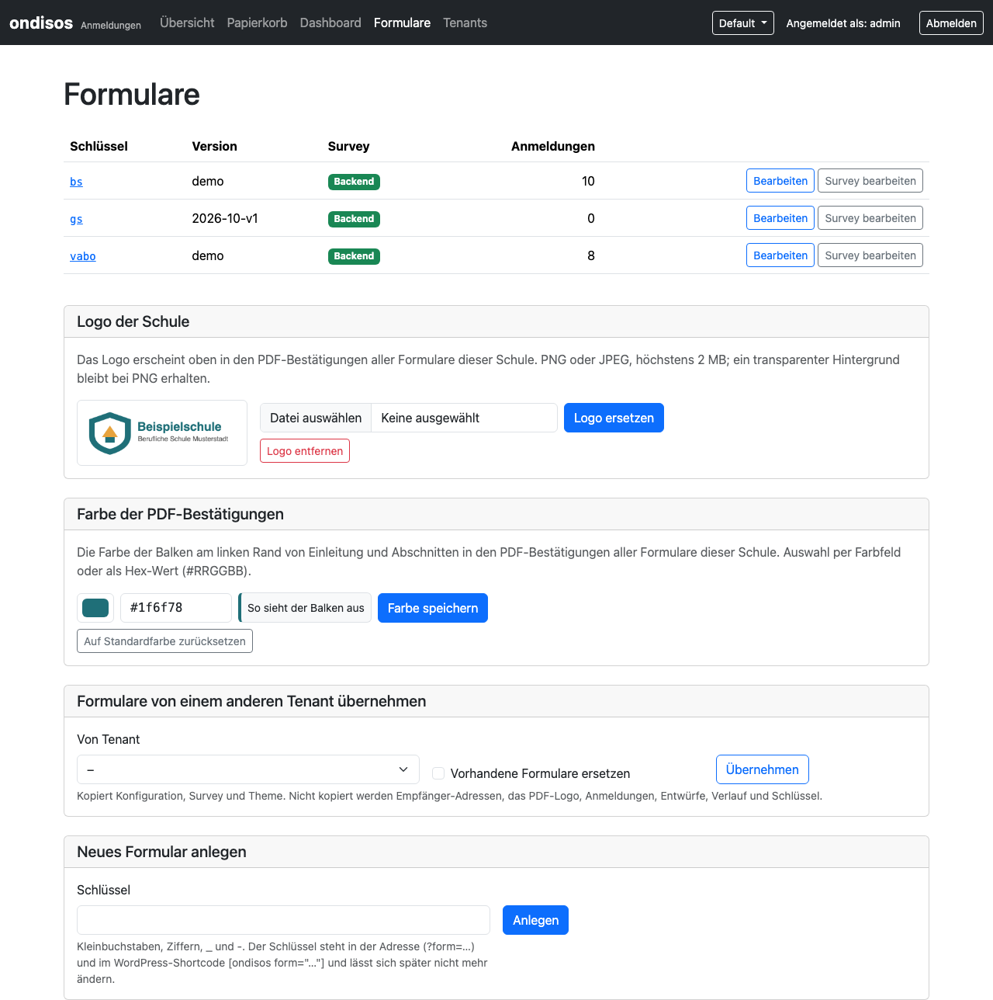
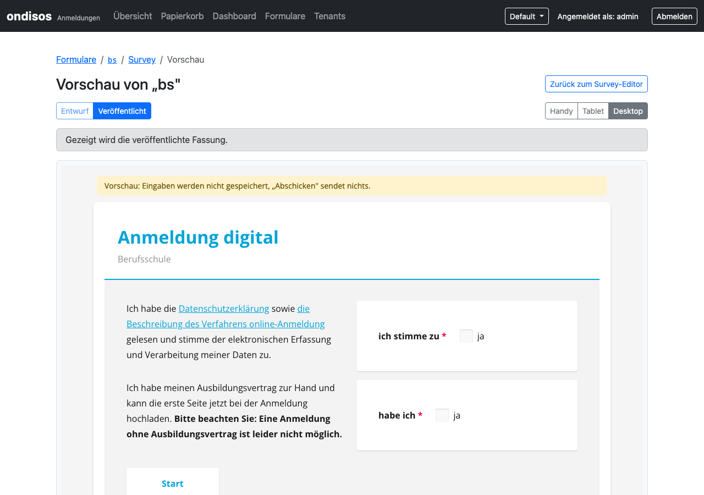
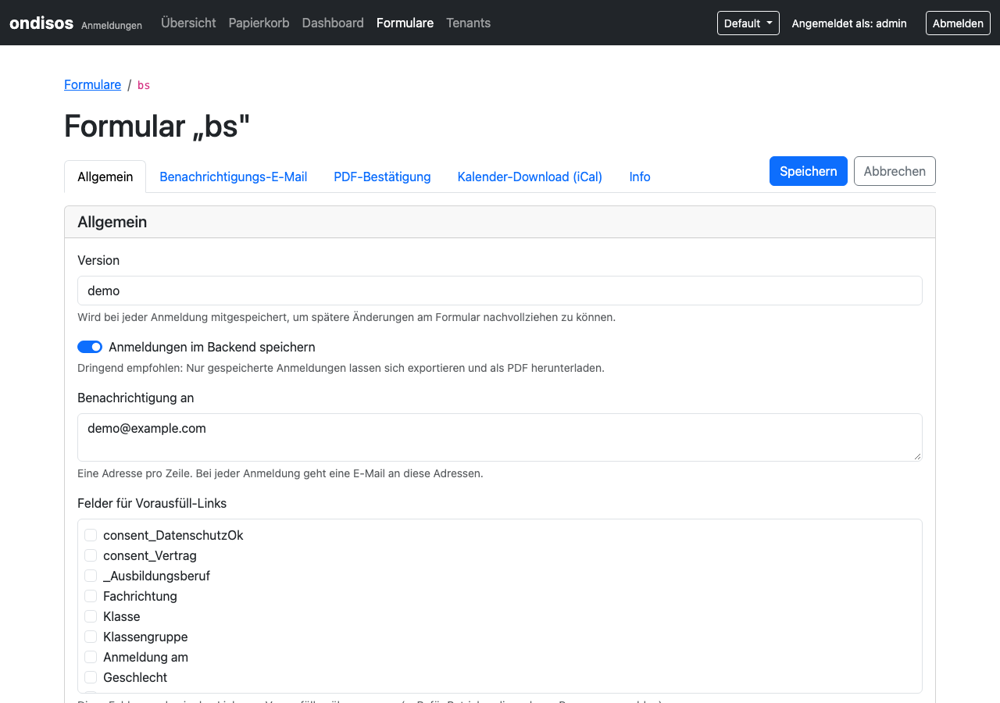

# 🎨 SurveyJS-basierte Formular-Erstellung und -Anpassung

## 📋 Inhaltsverzeichnis

- [Überblick](#überblick)
- [Formulare entwerfen (SurveyJS Creator)](#formulare-entwerfen-surveyjs-creator)
  - [Lizenzhinweis](#lizenzhinweis)
- [Workflow im Backend](#workflow-im-backend)
  - [Bestehendes Formular ändern](#bestehendes-formular-ändern)
  - [Neues Formular erstellen](#neues-formular-erstellen)
  - [Vorschau](#vorschau)
  - [Verlauf und Wiederherstellen](#verlauf-und-wiederherstellen)
- [Zusammenhang: Formular-Konfiguration ↔ Survey](#zusammenhang-formular-konfiguration--survey)
- [Surveys als Dateien (Fallback)](#surveys-als-dateien-fallback)

## Überblick

Ein Formular besteht aus zwei Teilen:

- der **Survey**: dem SurveyJS-JSON mit Seiten, Fragen und Texten (das, was Besucher sehen), und
- der **Formular-Konfiguration**: Empfänger der Benachrichtigung, PDF-Bestätigung, Vorausfüll-Links usw.

Beides pflegen Schul-Admins im Backend unter **Formulare** (ab Version 3.1). Surveys und Themes liegen in der Datenbank (pro Schule), das Frontend holt sie
zusammen mit der Konfiguration vom Backend.



## Formulare entwerfen (SurveyJS Creator)

Zum Entwerfen dient der Drag-and-Drop-Designer von SurveyJS, erreichbar über
https://surveyjs.io/create-free-survey

Der Creator ist **nicht Teil von Ondisos**. Das Backend enthält nur einen Code-Editor, in den das JSON aus dem Creator eingefügt wird.

### Lizenzhinweis

Die SurveyJS-Bibliothek, die Ondisos zur Anzeige der Formulare nutzt, ist quelloffen (MIT). Der **Creator** ist dagegen proprietär lizenziert; deshalb wird er
weder mitgeliefert noch in das Backend eingebunden. Für seine Nutzung gelten die Bedingungen von SurveyJS (https://surveyjs.io/licensing).

## Workflow im Backend

```
Backend: Formulare → Survey bearbeiten
        │  „JSON kopieren"
        ▼
SurveyJS Creator (Designer ↔ JSON-Editor)
        │  fertiges JSON kopieren
        ▼
Backend: JSON einfügen → Prüfen → Entwurf speichern → Vorschau → Veröffentlichen
        │
        ▼
Frontend / WordPress zeigt die veröffentlichte Fassung
```

### Bestehendes Formular ändern

1. **Formulare** öffnen und beim Formular **Survey bearbeiten** wählen. Im Editor steht die veröffentlichte Fassung.
2. **JSON kopieren** und im Creator unter *JSON Editor* einfügen.
3. Im **Designer** bearbeiten, danach das JSON aus dem *JSON Editor* des Creators kopieren.
4. Im Backend das JSON im Editor ersetzen und **Prüfen** wählen. Die Prüfung nennt Fehler mit Zeile und Spalte, zeigt die geänderten Felder (Feldänderungen, Diff) und
   verlangt, dass das Formular einen Namen und eine E-Mail-Adresse erfasst. Auch unsichere HTML-Inhalte in Texten werden beanstandet.
5. **Entwurf speichern**: Das veröffentlichte Formular bleibt unverändert. Pro Formular gibt es höchstens einen Entwurf.
6. **Vorschau** ansehen (siehe unten), danach **Veröffentlichen**. Die Formular-Version kann dabei angepasst werden (ein Vorschlag wird gemacht); sie wird mit jeder
   Anmeldung gespeichert, so lässt sich später nachvollziehen, nach welchem Stand ausgefüllt wurde.


Wurde die Survey zwischenzeitlich von jemand anderem veröffentlicht, bleibt Ihr Entwurf gespeichert, wird aber nicht veröffentlicht. Der Editor zeigt den Unterschied; nach der Prüfung lässt sich erneut veröffentlichen.

### Neues Formular erstellen

1. **Formulare → Neues Formular anlegen**: Schlüssel eingeben (Kleinbuchstaben, Ziffern, `_` und `-`). Der Schlüssel steht in der Adresse (`?form=<schlüssel>`) und im
   WordPress-Shortcode `[ondisos form="<schlüssel>"]` und lässt sich später nicht mehr ändern.
2. Die **Formular-Konfiguration** ausfüllen (Empfänger, PDF-Bestätigung usw., siehe unten).
3. **Survey bearbeiten**: das im Creator entworfene JSON einfügen und wie oben prüfen, als Entwurf speichern und veröffentlichen.
4. Einbetten: Standalone `…/index.php?form=<schlüssel>`, WordPress `[ondisos form="<schlüssel>"]`.

Eine neue Schule kann stattdessen mit den Formularen einer anderen Schule beginnen (*Formulare von einem anderen Tenant übernehmen*, siehe [MULTI-TENANT.md](../betreiber/MULTI-TENANT.md)).
Empfänger-Adressen und Logo werden dabei nie kopiert.

### Vorschau

Die Vorschau zeigt Entwurf oder veröffentlichte Fassung genau so, wie Besucher das Formular sehen, in den Breiten Handy, Tablet und Desktop. Eingaben werden nicht gespeichert,
„Abschicken“ sendet nichts. Die Vorschau läuft in einem abgeschotteten Rahmen und ändert nichts am Live-Formular.



So sieht das Formular für Besucher aus:


### Verlauf und Wiederherstellen

Jede Veröffentlichung landet im Verlauf (die letzten 50 Stände je Formular und Typ). Ein früherer Stand lässt sich im Survey-Editor unter *Verlauf* wiederherstellen; die
Wiederherstellung wird im Verlauf vermerkt („Wiederhergestellt aus Revision …“).

## Zusammenhang: Formular-Konfiguration ↔ Survey

Der Schlüssel der Formular-Konfiguration (`form_key`) bestimmt den URL-Parameter (`?form=<key>`) und den WordPress-Shortcode (`[ondisos form="<key>"]`). Die Konfiguration
verweist mit *Survey-Datei* und *Theme-Datei* auf die Survey und das Design-Theme (Name, z. B. `bs.json` und `survey_theme.json`); beides liegt als Ressource im Backend.

Die Konfiguration wird im Formular-Editor in Tabs gepflegt: *Allgemein*, *Benachrichtigungs-E-Mail*, *PDF-Bestätigung*, *Kalender-Download (iCal)* und *Info*.



Für jedes Formular lassen sich konfigurieren:

- Empfänger einer Benachrichtigungs-Mail
- ob die Daten in der Datenbank gespeichert werden. Es ist auch denkbar, Anmeldungen nur per interner E-Mail entgegenzunehmen, ohne sie zu speichern. Das ist *nicht* empfohlen,
  da E-Mail-Benachrichtigungen nicht so zuverlässig sind wie ein Abspeichern. Ohne Speichern ist eine gültige Empfänger-Adresse **Pflicht**: Ohne Empfänger gingen die Daten
  verloren, deshalb zeigt das Frontend so ein Formular nicht an.
- ob ein PDF-Download nach dem Absenden angezeigt wird (Logo und Farbe der Schule, optional ein angehängtes PDF, PDF-Vorschau)
- ob Teile des Formulars als Link vorausgefüllt weitergegeben werden können (für Firmen, die regelmäßig Auszubildende anmelden)


⚠️ **Wichtig:** Es ist kein E-Mail-Versand der Formulardaten an den Benutzer vorgesehen, da diese unverschlüsselt übermittelt würden. Soll der Benutzer eine Bestätigung
erhalten, muss die PDF-Bestätigung aktiviert werden: Sie wird TLS-verschlüsselt (über https) an das Endgerät übertragen.

Die Konfiguration lässt sich auch per Skript einspielen: `php backend/seed-forms.php [--tenant=<slug>]` (fügt neue Formulare hinzu, überschreibt vorhandene nie, prüft jeden
Eintrag; Vorlage: [frontend/config/forms-config-dist.php](../../frontend/config/forms-config-dist.php)), siehe [MIGRATION-3.0.md § 6](../betreiber/MIGRATION-3.0.md#6-danach-formular-konfiguration-ändern).

## Surveys als Dateien (Fallback)

Bis zur Version 3.0 lagen die Surveys als JSON-Dateien im Frontend (`frontend/surveys/`). Das funktioniert weiterhin als **Fallback**: Liefert das Backend für den Namen keine
Survey, nutzt das Frontend die Datei. Sobald eine Survey im Backend liegt, hat sie Vorrang; wer beides pflegt, sieht die Datenbank-Fassung.

Vorhandene Dateien lassen sich in die Datenbank übernehmen:

```bash
php backend/import-surveys.php [--tenant=<slug>] [--overwrite] [--dry-run] frontend/surveys
```

Details und Upgrade-Hinweise: [MIGRATION-3.1.md](../betreiber/MIGRATION-3.1.md). Der Datei-Fallback soll später entfallen (kein Termin); die Dateien bleiben dann nur Importquelle.
