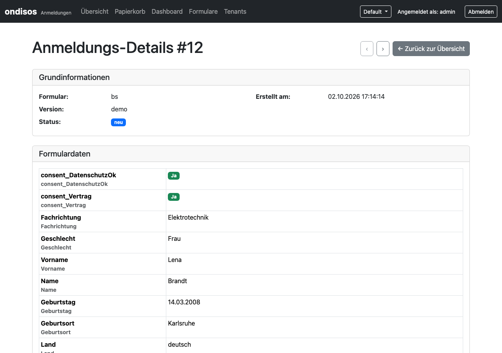

# Handreichung für das Sekretariat

Diese Anleitung ist für alle, die in der Schule die **eingehenden Anmeldungen** bearbeiten: nachsehen, was neu ist,
einzelne Anmeldungen ausdrucken, Daten als Excel-Datei herunterladen und in die Schulverwaltung (ASV-BW) übernehmen.
Technische Kenntnisse brauchen Sie dafür nicht.

**Was Sie von Ihrer IT bzw. vom Betreiber brauchen:** die Adresse des Backends, Ihren Benutzernamen und Ihr Passwort.
Das Backend ist in der Regel nur im Schulnetz oder über das Netz des Schulträgers erreichbar.

---

## 1. Anmelden

1. Öffnen Sie die Adresse des Backends im Browser.
2. Tragen Sie **Benutzername** und **Passwort** ein und klicken Sie auf **Anmelden**.
3. Sie landen auf der Seite **Anmeldungen**. Mit **Abmelden** oben rechts beenden Sie die Sitzung.
   Nach längerer Untätigkeit (Standard: 1 Stunde) werden Sie automatisch abgemeldet und müssen sich neu anmelden.

Die Menüpunkte **Formulare** und **Tenants** brauchen Sie für die tägliche Arbeit nicht (sie sind für Formularpflege und Einrichtung gedacht).

## 2. Sehen, was neu ist

Die Seite **Anmeldungen** zeigt alle eingegangenen Anmeldungen, die neuesten oben.

- **Status** (farbiges Etikett): *Neu* · *Exportiert* · *In Bearbeitung* · *Akzeptiert* · *Abgelehnt* · *Archiviert*.
  Jede Anmeldung beginnt als *Neu*.
- **Filtern:** Über die Auswahl **Alle Formulare** wählen Sie ein einzelnes Formular, in der Spalte **Status** nur einen Status
  (z. B. *Neu*). In den Feldern unter **Name** und **E-Mail** können Sie nach Namen suchen.
- **Sortieren:** Klick auf eine Spaltenüberschrift mit Pfeil (Name, E-Mail, Status, Datum).
- **Einträge pro Seite:** 10, 25, 50 oder 100.
- Das **Dashboard** (Menü oben) zählt die Anmeldungen je Status und bietet unter **Schnellzugriff** direkt „Neue Anmeldungen".

## 3. Eine Anmeldung ansehen

Ein Klick auf die Nummer (z. B. **#6**) öffnet die **Detailansicht** mit allen Angaben. Mit den Pfeilen **‹** und **›** oben rechts springen
Sie zur vorherigen bzw. nächsten Anmeldung, **← Zurück zur Übersicht** bringt Sie zur Liste.

Unten finden Sie die Werkzeuge für diese eine Anmeldung:

| Schaltfläche | Was sie tut |
|---|---|
| **📥 Excel-Export** | lädt nur diese Anmeldung als Excel-Datei herunter (war die Anmeldung *Neu*, steht sie danach auf *Exportiert*, wie beim Export aus der Liste) |
| **PDF Bestätigung** | erzeugt die PDF-Bestätigung dieser Anmeldung (Dateiname `bestaetigung-<formular>-<nr>.pdf`) |
| **Status ändern:** 📝 / ☑️ / 👎 | *In Bearbeitung* / *Akzeptiert* / *Abgelehnt* (Mauszeiger darüber zeigt den Namen) |
| **🗑️ Löschen** | verschiebt die Anmeldung in den Papierkorb (nach einer Rückfrage) |

Hochgeladene Dateien (z. B. Zeugnisse) erscheinen in der Detailansicht als Download-Links.

## 4. Ausdrucken

Eine eigene Druckansicht gibt es nicht. Zum Ausdrucken öffnen Sie in der Detailansicht **PDF Bestätigung**: Das ist
dieselbe saubere Übersicht mit Schullogo, die auch die Anmeldenden erhalten, und lässt sich wie jedes PDF drucken.

## 5. Als Excel herunterladen und in ASV-BW importieren

Auf der Seite **Anmeldungen**:

1. Filtern Sie in der Spalte **Status** auf **Neu** (und ggf. oben auf das gewünschte Formular).
2. Setzen Sie das Häkchen in der Kopfzeile der Tabelle: Damit sind alle angezeigten Anmeldungen ausgewählt.
   Einzelne Anmeldungen wählen Sie über das Kästchen vor der Nummer.
3. Klicken Sie auf **📥 Excel-Export**. Der Browser lädt die Datei herunter.
4. Alle exportierten Anmeldungen, die bisher *Neu* waren, stehen danach auf **Exportiert**. Wer bereits *In Bearbeitung*,
   *Akzeptiert* usw. war, behält seinen Status.

> **Achtung:** Ohne Auswahl exportiert der Knopf **alle** Anmeldungen (des gewählten Formulars) – auch bereits exportierte
> und archivierte. Wählen Sie deshalb vorher aus, damit nichts doppelt in ASV landet.

Die Excel-Datei lässt sich in das Schüler-Modul von ASV-BW importieren, wenn das Formular die passenden Feldbezeichner enthält.
Die Schritte dafür stehen in **[ASV.md](ASV.md)**.

## 6. Bearbeitungsstand pflegen

Den Status ändern Sie in der Detailansicht (📝 ☑️ 👎) oder für **mehrere Anmeldungen auf einmal** in der Liste: Kästchen vor den Nummern ankreuzen (das Kästchen in der Kopfzeile wählt alle angezeigten aus) und oben auf 📝 *In Bearbeitung*, ☑️ *Akzeptiert* oder 👎 *Abgelehnt* klicken. Das System fragt vor dem Ändern nach und meldet danach, wie viele Einträge geändert wurden. So behalten Sie und Ihre Kolleginnen und Kollegen den Überblick:

| Status | Bedeutung |
|---|---|
| Neu | eingegangen, noch nicht angesehen/exportiert |
| Exportiert | als Excel heruntergeladen |
| In Bearbeitung | wird geklärt (z. B. Unterlagen fehlen) |
| Akzeptiert / Abgelehnt | Entscheidung getroffen |
| Archiviert | erledigt |

## 7. Aufräumen: Archivieren, Löschen, Papierkorb

In der Liste markieren Sie Einträge und nutzen die Schaltflächen darüber:

- **📦 Archivieren** – für erledigte Anmeldungen. **Wichtig:** Archivierte Anmeldungen werden nach einer festen Frist
  (Standard **90 Tage** nach der letzten Änderung, einstellbar durch den Betreiber) **endgültig und samt hochgeladener Dateien gelöscht**.
  Das Dashboard zeigt unter *Auto-Expunge Status*, wann das nächste Mal aufgeräumt wird und wie viele Einträge anstehen.
  Exportieren Sie also vorher, was Sie noch brauchen.
- **🗑️ Löschen** – verschiebt in den **Papierkorb** (Menü oben). Dort lassen sich Einträge mit **↩️ Wiederherstellen** zurückholen
  oder mit **⚠️ Endgültig löschen** unwiderruflich entfernen.
- **🔄 Ansicht aktualisieren** lädt die Liste neu, z. B. wenn inzwischen neue Anmeldungen eingegangen sind.

Vor jedem Archivieren und Löschen fragt das System noch einmal nach.

## Hilfe

- Passwort vergessen oder Zugang gesperrt → Ihre Schul-IT bzw. der Betreiber des Backends.
- Formular ändern (neue Felder, Texte, Empfänger der Benachrichtigung) → Redaktion, siehe [Formulare pflegen](../redaktion/SURVEYJS.md).
- Eine Anmeldung fehlt oder das Formular zeigt eine Wartungsmeldung → Schul-IT: Frontend und Backend müssen sich erreichen können.
