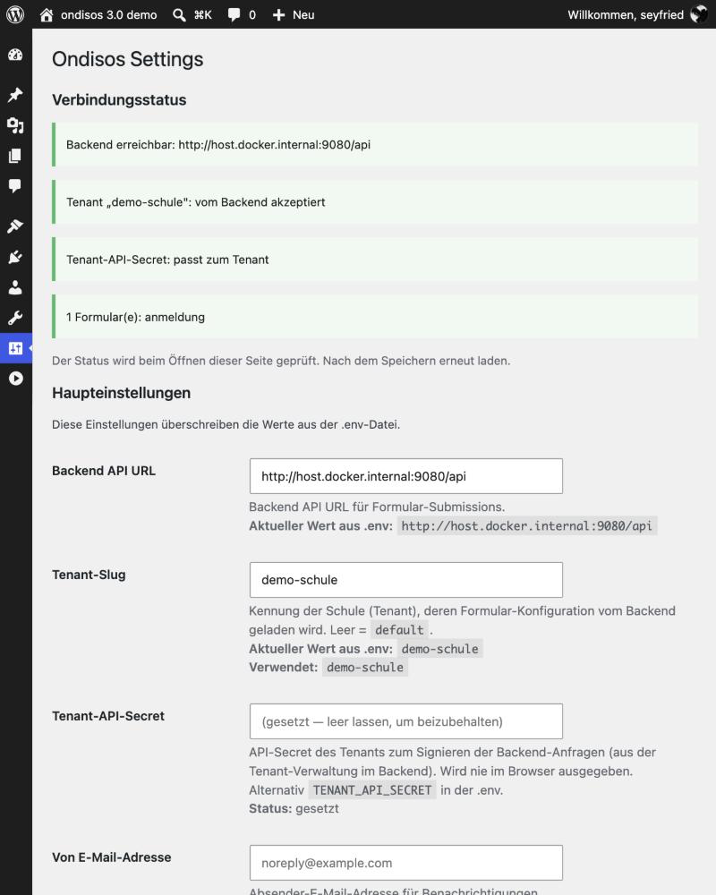

# WordPress-Plugin installieren

Das Plugin **ondisos** bindet die Anmeldeformulare per Shortcode in WordPress-Seiten ein:

```
[ondisos form="bs"]
```

Die Formulardaten werden **nicht** in WordPress gespeichert: Das Plugin leitet sie serverseitig an das
Ondisos-Backend weiter (signiert mit dem Secret des Tenants), das im Intranet laufen sollte.

- Plugin-Version: **3.1.0** — benötigt ein **Ondisos-Backend ab 3.0** (Surveys aus dem Backend und der erweiterte Verbindungsstatus ab Backend 3.1)
- Upgrade von einer älteren Installation: [MIGRATION-3.0.md](../docs/betreiber/MIGRATION-3.0.md)
- Mehrere Schulen / Tenants: [MULTI-TENANT.md](../docs/betreiber/MULTI-TENANT.md)

## Inhalt

1. [Voraussetzungen](#voraussetzungen)
2. [Installation](#installation)
3. [Konfiguration](#konfiguration)
4. [Testen](#testen)
5. [Aktualisieren](#aktualisieren)
6. [Fehlersuche](#fehlersuche)
7. [Deinstallation](#deinstallation)
8. [Sicherheitshinweise](#sicherheitshinweise)

---

## Voraussetzungen

- WordPress 5.8+, PHP 8.1+ (PHP-Extension `curl`)
- Ein laufendes Ondisos-Backend (3.0+), das **vom WordPress-Server aus** erreichbar ist
  (die Anfragen kommen serverseitig von WordPress, nicht aus dem Browser)
- Im Backend: ein Tenant (für eine Schule genügt Tenant 1, Slug `default`) mit **API-Secret** und
  eingespielter Formular-Konfiguration (`seed-forms.php`) — siehe [installation.md](../docs/betreiber/installation.md)
- Der Webserver muss Symlinks folgen, falls Variante A (Symlinks) benutzt wird (Variante C braucht das nicht)

## Installation

### Variante C — fertige ZIP (ohne Shell, empfohlen für Schulen)

Die Release-ZIP `ondisos-<version>.zip` enthält das Plugin **und** den benötigten Frontend-Code (PHP-Klassen, SurveyJS, Schriften). Es ist nichts weiter zu kopieren:

1. WordPress-Admin → *Plugins → Installieren → Plugin hochladen* → ZIP wählen → *Installieren* → *Aktivieren*.
2. *Einstellungen → Ondisos*: Backend-URL, Tenant-Slug und Secret eintragen (siehe unten).

Die Prüfsumme steht in `ondisos-<version>.zip.sha256` (`shasum -a 256 -c ondisos-<version>.zip.sha256`). Die ZIP ist für alle Schulen gleich und enthält keine Zugangsdaten.
Erzeugen (im Repository): `make plugin-zip` bzw. `wordpress-plugin/build-zip.sh` → `dist/`. Es werden nur versionierte Dateien aufgenommen.

Wer von Variante A oder B auf C wechselt: Plugin-Ordner (bzw. Symlink) `ondisos` und `ondisos-frontend` entfernen, dann die ZIP installieren. Die Einstellungen bleiben erhalten (sie liegen in der WordPress-Datenbank).
Eine `.env` im Frontend-Verzeichnis gibt es in dieser Variante nicht; alles wird unter *Einstellungen → Ondisos* gesetzt.

### Varianten A und B — Code aus dem Repository

Hier erwartet das Plugin den Frontend-Code **neben** sich. Zwei Layouts werden unterstützt:

| Layout | Verzeichnisse | Typischer Einsatz |
|---|---|---|
| **A — Git-Clone auf dem Server** | `…/ondisos/wordpress-plugin/` und `…/ondisos/frontend/` (ein Repository) | Server mit Git-Checkout; Updates per `git pull` |
| **B — Docker / getrennte Verzeichnisse** | `wp-content/plugins/ondisos/` **und** `wp-content/plugins/ondisos-frontend/` | Docker-Volumes oder Symlinks |

Der Code wählt automatisch (Konstante `ONDISOS_LAYOUT`, sichtbar unter *Einstellungen → Ondisos → Systeminfo*): Gibt es `ondisos/frontend/src/`, gilt Layout C; sonst, wenn `plugins/ondisos-frontend/` existiert, Layout B; sonst das Verzeichnis `frontend/` neben dem Plugin (Layout A).

### Variante A — Git-Clone mit Symlink

```bash
# Repository klonen bzw. aktualisieren (irgendwo außerhalb des WordPress-Verzeichnisses)
git clone https://gitlab.hhs.karlsruhe.de/digitale-schulverwaltung/ondisos.git /opt/ondisos
cd /opt/ondisos && git checkout v3.0.0      # Release-Tag (sobald veröffentlicht)

# Symlink ins WordPress-Plugin-Verzeichnis (absoluter Pfad!)
cd /var/www/html/wp-content/plugins
ln -s /opt/ondisos/wordpress-plugin ondisos
ls -la ondisos                               # → ondisos -> /opt/ondisos/wordpress-plugin
```

Die Frontend-Assets (SurveyJS, Fonts) liefert der mitgelieferte Symlink
`wordpress-plugin/frontend-assets → ../frontend/public`. Der Webserver muss deshalb Symlinks folgen:

```apache
<Directory /var/www/html>
    Options +FollowSymLinks
    AllowOverride All
    Require all granted
</Directory>
```

Nginx folgt Symlinks standardmäßig (kein `disable_symlinks`).

Hilfsskript: `SYMLINK-SETUP.sh` (Pfade oben im Skript anpassen, dann `sudo ./SYMLINK-SETUP.sh`).

### Variante B — Docker oder getrennte Verzeichnisse

Beide Verzeichnisse als Plugins bereitstellen (Volumes oder Symlinks):

```yaml
# docker-compose.yml des WordPress-Containers (Ausschnitt)
volumes:
  - /opt/ondisos/wordpress-plugin:/var/www/html/wp-content/plugins/ondisos
  - /opt/ondisos/frontend:/var/www/html/wp-content/plugins/ondisos-frontend
```

Ohne Docker entsprechend zwei Symlinks (`ondisos` → `…/wordpress-plugin`, `ondisos-frontend` → `…/frontend`).
Das Verzeichnis `ondisos-frontend` ist **kein** eigenes Plugin und wird nicht aktiviert.

### Rechte

Das WordPress-Benutzerkonto (z. B. `www-data`) muss beide Verzeichnisse lesen können
(Verzeichnisse 755, Dateien 644).

WordPress legt den Formular-Cache unter `wp-content/uploads/ondisos-cache/` an (ab 3.1; beschreibbar wie der Rest von `uploads`).
Er enthält die zuletzt vom Backend gelieferte Fassung eines Formulars und hält das Formular verfügbar, wenn das Backend
kurz nicht erreichbar ist. Ohne Schreibrecht arbeitet das Plugin ohne Cache.

### Plugin aktivieren

WordPress-Admin → *Plugins* → **„ondisos - Onboarding Digital Souverän + Open Source"** → *Aktivieren*.

## Konfiguration

*Einstellungen → Ondisos*. Oben steht der Verbindungsstatus (Backend erreichbar, Tenant akzeptiert, Secret passt, Zahl der Formulare):



| Feld | Bedeutung |
|---|---|
| **Backend API URL** | URL der Backend-API, z. B. `http://intranet.example.com:9080/api` — **bei WordPress in Docker siehe unten** |
| **Tenant-Slug** | Kennung der Schule im Backend; leer = `default` (Tenant 1) |
| **Tenant-API-Secret** | Secret des Tenants; signiert alle Anfragen ans Backend. Wird **nie wieder angezeigt**; leer lassen bedeutet „unverändert" |
| **Von E-Mail-Adresse** | Absender der Benachrichtigungs-E-Mails |

Die Seite zeigt oben einen **Verbindungsstatus** (wird beim Öffnen geprüft): ob das Backend unter der eingetragenen URL antwortet, ob der Tenant
vom Backend akzeptiert wird und ob ein Secret gesetzt ist. Beim **Speichern** einer URL, unter der das Backend nicht antwortet, erscheint eine Warnung
(die URL wird trotzdem gespeichert). Ob das Secret zum Tenant passt, lässt sich erst beim ersten Absenden feststellen.

### Backend-URL, wenn WordPress in Docker läuft

Das Plugin ruft das Backend **vom WordPress-Container aus** auf. In einem Container ist `localhost` der Container selbst, nicht dein Rechner — mit
`http://localhost:9080/api` findet WordPress das Backend deshalb nicht. Je nach Aufbau:

| Aufbau | Backend API URL |
|---|---|
| Backend läuft auf demselben Docker-Host und ist über einen Port veröffentlicht (Docker Desktop: Mac/Windows) | `http://host.docker.internal:9080/api` |
| Dasselbe unter Linux | im WordPress-Dienst `extra_hosts: ["host.docker.internal:host-gateway"]` eintragen, dann wie oben |
| WordPress und Backend teilen ein Docker-Netzwerk | `http://<dienstname>/api`, z. B. `http://backend/api` (ohne Port, wenn der Container auf 80 lauscht) |
| Backend auf einem anderen Server | dessen Adresse, z. B. `https://backend.example.org/api` |

Das Plugin warnt, wenn in einem Container `localhost`/`127.0.0.1` eingetragen wird.

**Woher das Secret kommt:** Tenant 1 verwendet den `API_SECRET_KEY` aus der Backend-`.env`; weitere Tenants
zeigen ihr Secret einmalig nach dem Anlegen in `tenants.php` (siehe [MULTI-TENANT.md](../docs/betreiber/MULTI-TENANT.md)).

**Alternative `.env`:** Dieselben Werte können in `.env` im Frontend-Verzeichnis stehen
(`BACKEND_API_URL`, `TENANT_SLUG`, `TENANT_API_SECRET`, `FROM_EMAIL`). **Die WordPress-Einstellungen haben Vorrang.**

> **Wichtig:** Liegt das Frontend-Verzeichnis unterhalb von `wp-content/plugins/` (Layout B), ist eine dort
> abgelegte `.env` **über den Webserver abrufbar**, sofern nicht gesperrt. Bevorzuge die WordPress-Einstellungen
> (Secret liegt in der Datenbank) oder sperre Dotfiles:
>
> ```apache
> <FilesMatch "^\.env">
>     Require all denied
> </FilesMatch>
> ```
> ```nginx
> location ~ /\.env { deny all; }
> ```

## Testen

1. Neue Seite anlegen, Shortcode `[ondisos form="bs"]` einfügen (den Formular-Key aus dem Backend verwenden).
2. Seite aufrufen — das Formular erscheint.
3. Testanmeldung absenden — im Backend taucht ein Eintrag mit Status `neu` auf; die PDF-Bestätigung (falls aktiviert)
   lässt sich herunterladen; Dateiuploads landen unter `uploads/tenant-<id>/` im Backend.

**Checkliste**

- [ ] Plugin erscheint in der Plugin-Liste und lässt sich aktivieren
- [ ] *Einstellungen → Ondisos* ist erreichbar, Status „Tenant-API-Secret: gesetzt"
- [ ] Shortcode rendert das Formular (kein „Unknown form"), SurveyJS und Fonts laden (Konsole ohne 404)
- [ ] Absenden funktioniert, Eintrag im Backend
- [ ] PDF-Download, Upload, Prefill-Link funktionieren (falls konfiguriert)

**Prefill:** Felder lassen sich per URL vorbelegen: entweder `?prefill=<base64-JSON>` (den Link erzeugt das System nach
einer Anmeldung) oder einfach per Parameter, z. B. `?Vorname=Erika&Klasse=5a`. Es werden nur Parameter übernommen,
die als Feldname im Formular existieren (Tracking-Parameter wie `utm_source` werden ignoriert).

## Aktualisieren

```bash
cd /opt/ondisos        # Layout A: Git-Repository
git pull               # bzw. git checkout <neues-Tag>
```

Die Änderungen sind sofort in WordPress wirksam (kein Neustart). Bei aktiven Cache-Plugins den Cache leeren;
die Plugin-Version ist an die Asset-URLs gekoppelt, sodass Browser geänderte JavaScript-Dateien neu laden.

Beim Wechsel von 2.x auf 3.0 zusätzlich die Schritte in [MIGRATION-3.0.md](../docs/betreiber/MIGRATION-3.0.md) ausführen
(Tenant-Slug und Tenant-API-Secret eintragen).

## Fehlersuche

| Symptom | Ursache / Lösung |
|---|---|
| Plugin erscheint nicht in der Liste | Symlink prüfen: `ls -la wp-content/plugins/ondisos`, `readlink -f …`; Plugin-Header in `ondisos.php` vorhanden? |
| Seite zeigt `Error: The form is currently unavailable` (Besucher) bzw. `Error (shown to administrators only): …` (angemeldete Administratoren) | Backend nicht erreichbar, Tenant abgelehnt oder unerwartete Antwort. **Als Administrator die Seite ansehen:** die Meldung nennt Ursache und Adresse. Zusätzlich zeigt *Einstellungen → Ondisos* den Verbindungsstatus. Vom **WordPress-Server** aus testen: `curl "<Backend-URL>/health.php"` |
| `Error: Unknown form "bs"` | Das Backend ist erreichbar, kennt das Formular aber nicht für den Tenant (Administratoren sehen den Tenant in der Meldung). `seed-forms.php` ausführen, Formular-Key im Shortcode und Tenant-Slug prüfen: `curl "<Backend-URL>/form-config.php?form=bs&tenant=<slug>"` |
| Absenden: „Unauthorized" | Tenant-API-Secret fehlt oder passt nicht zum Backend; Backend-Log prüfen (`tenant api_secret is a known placeholder/default` ⇒ echtes Secret setzen) |
| Absenden: „Backend-Zugang nicht konfiguriert" | Kein Tenant-API-Secret gesetzt (weder in den Einstellungen noch in der `.env`) |
| 403 Forbidden auf Plugin-Dateien | Variante A: `Options +FollowSymLinks`; Dateirechte und Besitzer prüfen |
| Assets (SurveyJS/Fonts) 404 | Variante A: Existiert `wordpress-plugin/frontend-assets` (Symlink → `../frontend/public`)? Variante B: `plugins/ondisos-frontend/public/assets/` vorhanden? |
| Formular lädt, PDF-Link schlägt fehl | Backend-URL und Erreichbarkeit vom WordPress-Server aus prüfen; Plugin-Proxy: `admin-ajax.php?action=ondisos_pdf_download` |
| Formular zeigt eine alte Fassung | Der Cache wird bei jedem Aufruf beim Backend per ETag geprüft; eine alte Fassung erscheint nur, wenn das Backend nicht erreichbar ist (dann bis zu 7 Tage). Backend-Erreichbarkeit prüfen; im Zweifel `wp-content/uploads/ondisos-cache/` leeren |
| Permission denied | `sudo chown -R www-data:www-data <ondisos>/wordpress-plugin <ondisos>/frontend` |

Debug-Log: `define('WP_DEBUG', true); define('WP_DEBUG_LOG', true);` → `wp-content/debug.log`.
Browser-Tab *Netzwerk*: Antwort von `admin-ajax.php?action=ondisos_submit`.

## Deinstallation

1. Plugin in WordPress deaktivieren und löschen — `uninstall.php` entfernt die Optionen
   (`ondisos_backend_url`, `ondisos_from_email`, `ondisos_tenant_slug`, `ondisos_tenant_api_secret`).
2. Symlinks bzw. Volumes entfernen (`rm wp-content/plugins/ondisos` — bei Symlinks **ohne** abschließenden `/`).
3. Quell-Repository nur löschen, wenn es nicht noch vom Backend oder anderen Installationen genutzt wird.

Anmeldedaten liegen im Backend und bleiben unberührt.

## Sicherheitshinweise

- ✅ CSRF-Schutz über WordPress-Nonces; Ausgaben werden escaped
- ✅ Anfragen ans Backend sind pro Tenant signiert (HMAC-SHA256); das Secret verlässt den Server nie
- ✅ Das Secret-Feld der Einstellungen ist schreibgeschützt (wird nie ins HTML zurückgegeben)
- ⚠️ Das Secret liegt im Klartext in `wp_options`: Datenbank-Zugriff und Backups von WordPress schützen
- ⚠️ Backend-URL in Production mit **HTTPS** (Signaturen enthalten keinen Zeitstempel)
- ⚠️ Dateien einer `.env` im Web-Verzeichnis sperren (siehe oben)
- ⚠️ Upload-Größen im Backend begrenzen (`UPLOAD_MAX_SIZE`)

## Mehrere WordPress-Installationen

Mehrere WordPress-Sites können denselben Code verwenden (Symlink bzw. Volume auf dasselbe Repository). Jede Site
hat **eigene** Einstellungen — bei verschiedenen Schulen jeweils mit dem passenden Tenant-Slug und -Secret.

## Support & Lizenz

Dokumentation: [../CLAUDE.md](../CLAUDE.md) · Lizenz: MIT (siehe [../LICENSE](../LICENSE))
